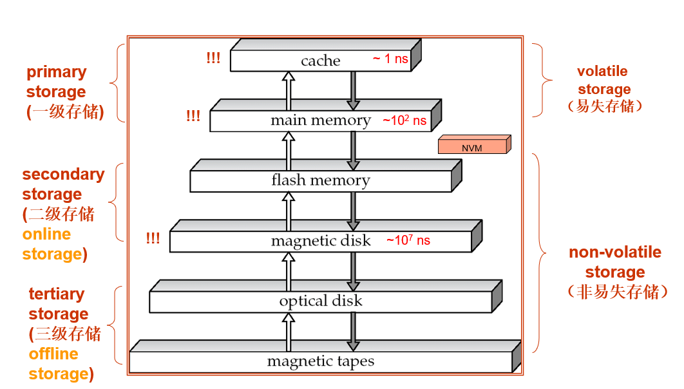
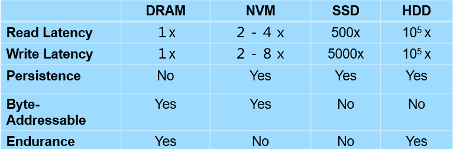

# 物理存储

## 存储分类

* 易失存储 volatile storage 
* 非易失存储 non-volatile storage 

* NVM（non-volatile memory）: 掉电不丢
* **primary storage**: Fastest media but volatile (cache, main memory).
* **secondary storage**: next level in hierarchy, non-volatile, moderately fast access time
	* also called **on-line storage** 
	* E.g. flash memory, magnetic disks
* **tertiary storage:** lowest level in hierarchy, non-volatile, slow access time
	* also called **off-line storage** 
	* E.g. magnetic tape, optical storage

## 磁盘（magnetic disks）

* 组成
	* tracks(磁道) 
	    * sectors(扇区)
* 时间
	* Access Time 访问时间，毫秒级
	* Seek Time 寻道时间：找到对应磁道
	* Rotational latency 旋转延迟：转到对应扇区
* Data-transfer rate 数据传输率
	* *数据库传输以block为单位* 

* 访问模式
    * Sequential access pattern(顺序访问模式)
      	* Successive requests are for successive disk blocks
      	* Disk seek required only for first block
    * Random access pattern（随机访问模式）
      	* Each access requires a seek
      	* *Transfer rates are low since a lot of time is wasted in seeks* 
      	* *尽量转化为顺序访问模式* 
* I/O operations per second (IOPS ，每秒I/O操作数)
  	* 衡量磁盘访问速度
  	* Number of random block reads that a disk can support per second
      50 to 200 IOPS on current generation magnetic disks

* Mean time to failure (MTTF，平均故障时间)
    * 衡量磁盘可靠性
    * the average time the disk is expected to run continuously without any failure

## 磁盘块访问的优化

* Buffering 缓存:
	* in-memory buffer to cache disk blocks
* Read-ahead(Prefetch)
	* Read extra blocks from a track in anticipation that they will be requested soon
* Disk-arm-scheduling
	* Disk-arm-scheduling algorithms re-order block requests so that disk arm movement is minimized 
* File organization（将碎片化的文件重新整理）
    * Allocate blocks of a file in as contiguous a manner as possible
    * Allocation in units of extents(盘区）
* Nonvolatile write buffers （非易失性写缓存）
	* speed up disk writes by writing blocks to a non-volatile RAM buffer immediately
* Log disk（日志磁盘）
    * a disk devoted to writing a sequential log of block updates
    * Used exactly like nonvolatile RAM

## Flash Storage

* NAND flash
    * Page can only be written once
    * Must be erased to allow rewrite
* SSD(Solid State Disks) 
    * 
    * SSD比磁盘快百倍，磁盘能耗高（机械运动）更新为即席写入
* Flash storage 中的地址映射漂移，已达成磨损均衡（wear leveling)
* 
* 对于大数据，热数据（常访问）放在SSD，冷数据放在磁盘里

* NVM，又称Storage Class Memory
    * 
    * Persistence可以看出是否易失
    * NVM和SSD与硬盘不同，用字节寻址

## 随堂测试

  * Which physical storage media is non-volatile?

    多选题 (1 分) 

     A.cache

     B.main memory

     C.flash memory

     D.magnetic disk

     E.SSD(State Solid Disk)

     F.magnetic tapes

     G.optical disk

    正确答案: C D E F G

  * Which physical storage medias belong to the secondary storage? 

    多选题 (1 分)

     A.cache

     B.main memory 

     C.flash memory

     D.SSD(Solid State Disk)

     E.magnetic disk

     F.magnetic tapes

     G.optical disk

    正确答案: C D E

  * Which term represents the time that the disk controller takes to reposition the disk arm over the correct track.

    单选题 (1 分)

     A.access time

     B.seek time

     C.rotational latency

     D.data-transfer rate 

    正确答案: B

  * What is the right approach to  optimizing  data access of disks?

    多选题 (1 分)

     A.Buffering

     B.Read-ahead

     C.defragment the file system

     D.Non-volatile write buffers

     E.Log disk

    正确答案: A B C D E

  * MTTF means    1   (注意：每个单词首字母大写).

    填空题 (1 分) (请按题目中的空缺顺序依次填写答案)

    正确答案: Mean Time To Failure

  * IOPS  means     1   (注意：每个单词首字母大写).

    填空题 (1 分) (请按题目中的空缺顺序依次填写答案)

    正确答案: I/O Operations Per Second