# 索引 Indexing

* Form：search key - pointer

## Query type

  * Point query: records with a specified value in the attribute

  * Range query: records with an attribute value falling in a specified range of values.

* Primary index 主索引

  * 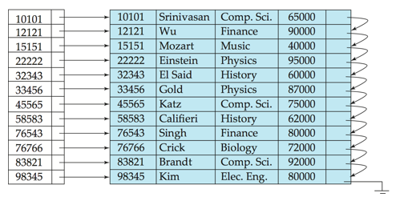
  * candidate key唯一情况下用起来方便

* Secondary Indices

  * 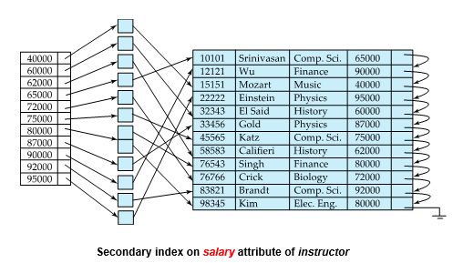
  * 不唯一，中间的指针指向多个目标
  * 

* Dense index：Index record appears for every search-key value in the file. 

  * 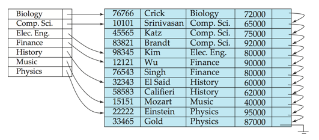

* Sparse index：contains index records for only some search-key values.

  * 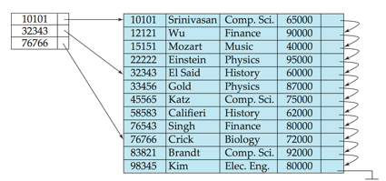
  * 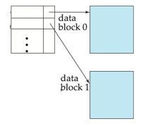

* Multilevel Index（多级索引）

  * 索引的索引
  * 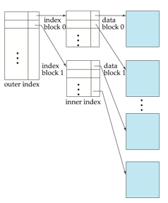

## B+ Tree Index

  * 每个节点都和block大小一样
  * 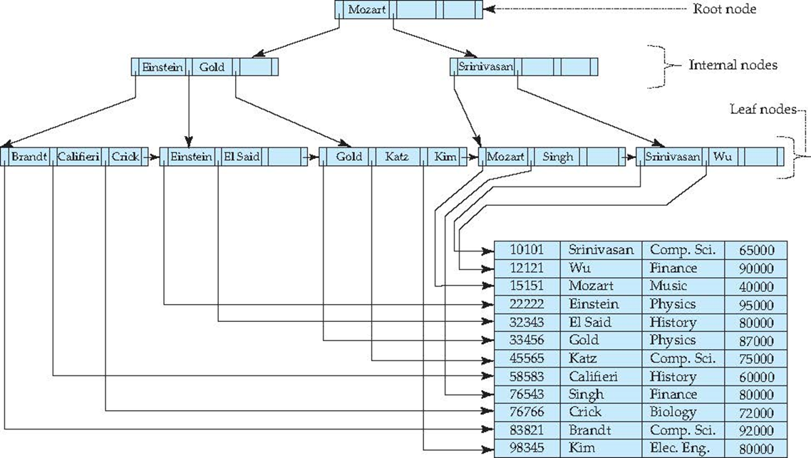
  * 叶子结点就是末级索引，之间用指针相连，使连续
  * 高度：$ log_{n}(k)<= height <=log_{n/2}(k/2)+1 $，向上取整（根节点最小两叉）
  * 大小：最大：半满，最小：全满
  * 和ADS不同：每个节点容量相等，非叶子和叶子一样（ADS里非叶子最多阶数-1）
    * 也就是说中间结点的分叉数比叶子结点值数多1
  * 作用：叉数多，层数少，减少seek&block transfer次数

* 估计 height & size

  * person( pid char(18) primary key,  

    ​			name char(8), 

    ​			age smallint,
    ​             address char(40)); 

    Block size : 4K
    1000000 persons

  * Records per block =  4096/(18+8+2+40) =60.235=60

    * record 大小根据各个属性类型算

  * blocks for storing 1M persons= 1000000/60 =16667

    * 计算block数

  * B+ tree n(fan-out)  = (4096-4)/(18+4) +1 = 187

    * B+树一个节点就是一个block，存放M个值和M+1个指针

      即使是叶子结点，也多出一个指向下一个叶子的指针

      指针比值多一个，所以先-4，后+1

    * 一个索引项=索引值+指针(假设4byte)=18+4

    * 最大187叉，最少 n/2 = 94叉

    * 能索引多少值

      * 2 levels:  min=2`*`93 = 186            max= 187'`*`186 = 34,782

      * 3 levels:  min=2`*`94`*`93 = 17484        max=187`*`187`*`186 = 6,504,234

      * 4 levels:  min=2`*`94`*`94`*`93 = 1,643,496

        ​			   max=187`*`187`*`187`*`186 = 1,216,291,758

    * 易得这个B+树为3层

  * size：

    * 最小（全满）100000/186+100000/186/187+1
    * 最大（半满）100000/93+100000/93/94+1

## Bottom-up B+ Tree Build

  * 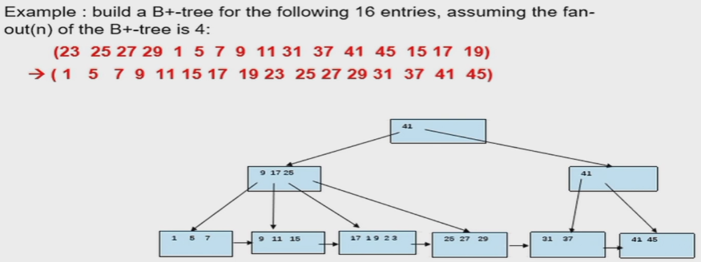
  * fanout = 4，则阶数为3
  * 先排序，按序分块，然后向上构建
  * 构建上图B+树 cost：1 seek + 9 block transfer
  * 插入大量值/合并树可以直接把叶子merge并排序，然后重建
  * 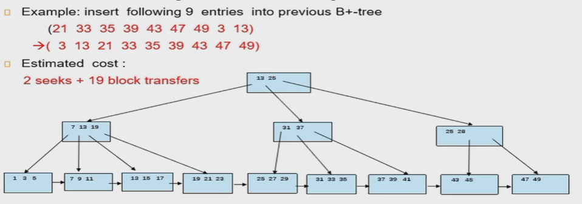
  * 原树的叶子读取：1 seek+6 block transfer

## Indexing in Main Memory

  * Random access in memory 
    * Much cheaper than on disk/flash, but still expensive compared to cache read
    * Binary search for a key value within a large B+-tree node results in many **cache misses**
    * Data structures that make best use of cache preferable – **cache conscious**
  * Cache miss
    * HD以block为单位读到buffer，buffer以64byte(例)为单位读到cache，大节点就会读不全，查找索引值过程中读取的cache只有小部分有用，没找到->产生miss
    * 降低miss：
      * 小节点：B+ trees with small nodes that fit in cache line are preferable to reduce cache misses
      * 指针和search key分开排
      * 建立一个“路标”（一棵小树）
  * Key idea:  
    * use large node size to optimize disk access, 
    * but structure data within a node using a tree with small node size, instead of using an array, to optimize cache access.

## LSM tree
  
  * Log Structured Merge：写优化的树结构
  * 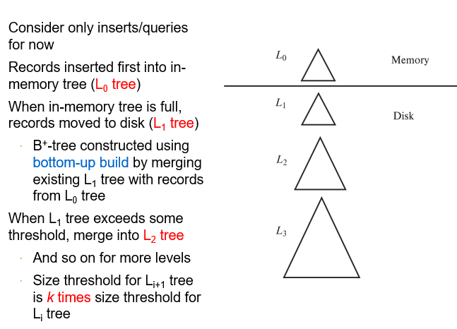
  * Benefits of LSM approach
    Inserts are done using only sequential I/O operations 随机写->顺序写
    Leaves are full, avoiding space wastage
    Reduced number of I/O operations per record inserted as compared to normal B+-tree (up to some size)
  * Drawback of LSM approach
    Queries have to search multiple trees
    Entire content of each level copied multiple times

* LSM-Stepped Merge Index

  * 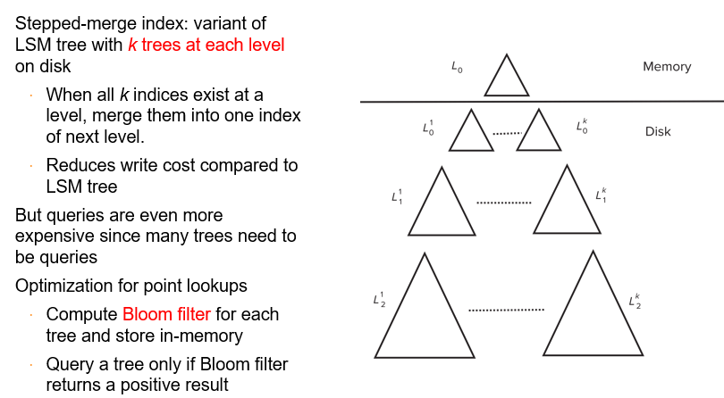
  * 内存满了直接写到下一层来，disk中这一层满了再merge写到下一层
  * 删除：插入删除标记
  * 更新：删除+插入

* Buffer Tree

  * 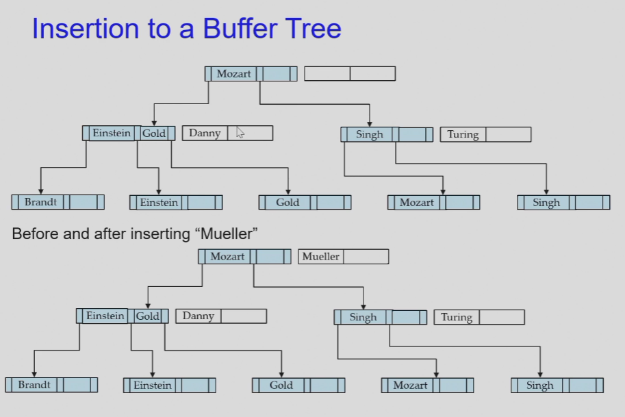

## 随堂测试

  * 1.Indexing mechanisms are used to speed up access  to desired data.

    判断题 (1 分)

     A.Yes

     B.No

    正确答案: A

  * 2.Range query returns records with an attribute value falling in a specified range of values.

    判断题 (1 分)

     A.Yes

     B.No

    正确答案: A

  * 3.Secondary index is an index whose search key specifies an order same as the sequential order of the file. 

    判断题 (1 分)

     A.Yes

     B.NO

    正确答案: B

  * 4.In an dense index, index record appears for every search-key value in the file. 

    判断题 (1 分)

    A.Yes

    B.No

    正确答案: A

  * 5.In a B+-tree , all paths from root to leaf are of the same length.

    判断题 (1 分)

    A.Yes

    B.No

    正确答案: A

  * 6.If the root of a B+-tree is not a leaf, it has at least 2 children.

    判断题 (1 分)

    A.Yes 

    B.No

    正确答案: A

  * 7.In databases, a node of a B+-tree is generally the same size as a disk block.

    判断题 (1 分)

    A.Yes

    B.No

    正确答案: A

  * 8.The leaf nodes of a B+-tree file organization store records, instead of pointers to records.

    判断题 (1 分)

    A.Yes

    B.No

    正确答案: A

  * 9.Benefits of LSM approach:

    多选题 (1 分)

    A.Inserts are done using only sequential I/O operations

    B.Leave nodes are full, avoiding space wastage

    C.Reduced number of I/O operations per record inserted as compared to normal B+-tree.

    D.Queries have to search multiple trees

    E.Entire content of each level copied multiple times

    正确答案: A B C

  * 10.Bitmap indices are useful for queries on multiple attributes,not particularly useful for single attribute queries.

    判断题 (1 分)

     A.Yes

     B. No

    正确答案: A