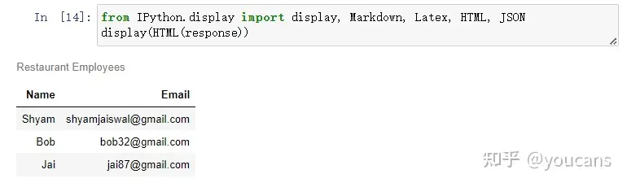
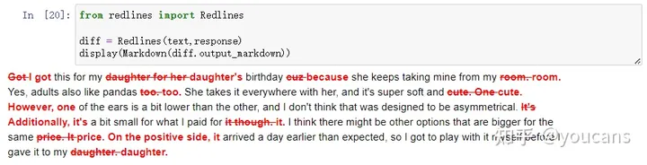
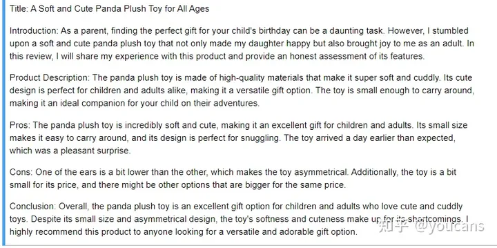
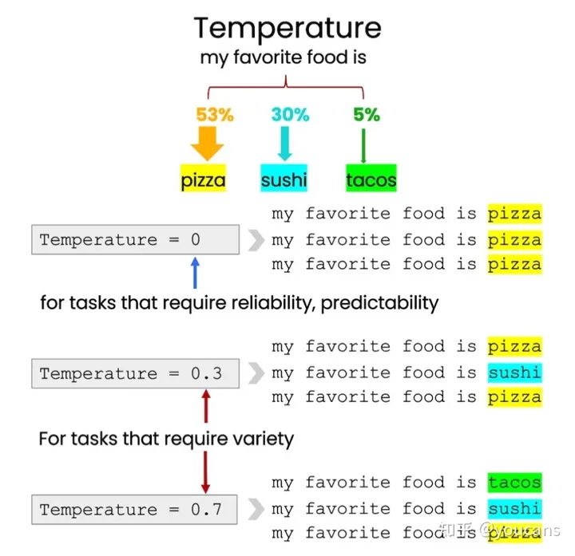

# Prompt提示词工程

## 系统配置

准备：使用openAI的python库

```python
# download
pip install openai
# use
import openai
openai.api_key = 'sk-'
```

## 1. 编写清晰而具体的提示

### 1.1 使用分隔符

```python
text = f"""
You should express what you want a model to do by \ 
providing instructions that are as clear and \ 
specific as you can possibly make them. \ 
This will guide the model towards the desired output, \ 
and reduce the chances of receiving irrelevant \ 
or incorrect responses. Don't confuse writing a \ 
clear prompt with writing a short prompt. \ 
In many cases, longer prompts provide more clarity \ 
and context for the model, which can lead to \ 
more detailed and relevant outputs.
"""
prompt = f"""
Summarize the text delimited by triple backticks \ 
into a single sentence.
```{text}```
"""
response = get_completion(prompt)
print(response) 
```

在提示中要求，将由三重反引号\```分隔的文本总结为一句话，再使用三重反引号\```把将文本{text}括起来。

还可以使用"""，---，< >，<tag> </tag>等进行分隔。

使用分隔符可以避免提示注入(injection，概念与DB中类同)，即在文本中输入会导致冲突的指令。

### 1.2 结构化输出

要求以指定格式输出（HTML、JSON等），下图为按照JSON格式生成的样例。

```python
[
  {
    "book_id": 1,
    "title": "The Lost City of Zorath",
    "author": "Aria Blackwood",
    "genre": "Fantasy"
  },
  {
    "book_id": 2,
    "title": "The Last Survivors",
    "author": "Ethan Stone",
    "genre": "Science Fiction"
  },
  {
    "book_id": 3,
    "title": "The Secret of the Haunted Mansion",
    "author": "Lila Rose",
    "genre": "Mystery"
  }
]
```

### 1.3 要求模型检查是否满足条件

如果结果不一定满足假设条件，可以要求模型先检查这些假设条件，不满足就指出并停止尝试完成完整的任务。

现在我复制一段文本，这是一段描述泡茶步骤的段落。然后复制提示，提示的内容是：你将获得由三个引号"""分隔的文本；如果它包含一系列指令，请按以下格式重写这些指令，只写出步骤；如果不包含一系列指令，则只需写出"未提供步骤"。

```python
text_1 = f"""
Making a cup of tea is easy! First, you need to get some \ 
water boiling. While that's happening, \ 
grab a cup and put a tea bag in it. Once the water is \ 
hot enough, just pour it over the tea bag. \ 
Let it sit for a bit so the tea can steep. After a \ 
few minutes, take out the tea bag. If you \ 
like, you can add some sugar or milk to taste. \ 
And that's it! You've got yourself a delicious \ 
cup of tea to enjoy.
"""
prompt = f"""
You will be provided with text delimited by triple quotes. 
If it contains a sequence of instructions, \ 
re-write those instructions in the following format:

Step 1 - ...
Step 2 - …
…
Step N - …

If the text does not contain a sequence of instructions, \ 
then simply write \"No steps provided.\"

\"\"\"{text_1}\"\"\"
"""
response = get_completion(prompt)
print("Completion for Text 1:")
print(response)
```

```
- 输出为：Completion for Text 1: Step 1 - Get some water boiling. Step 2 - Grab a cup and put a tea bag in it. Step 3 - Once the water is hot enough, pour it over the tea bag. Step 4 - Let it sit for a bit so the tea can steep. Step 5 - After a few minutes, take out the tea bag. Step 6 - Add some sugar or milk to taste. Step 7 - Enjoy your delicious cup of tea!
```

若这段文字中没有任何指令。我们仍然使用与刚才相同的提示，在这段文本上运行。模型将尝试提取指令， 如果它找不到任何指令，我们要求它只说“No steps provided”。

输出：Completion for Text 2: No steps provided.

### 1.4 少样本提示(few-shot prompt)

要求模型执行实际任务之前，向模型提供成功执行所需任务的示例。

在下面这个提示中，我们告诉模型，它的任务是以与示例一致的风格回答。我们给出了一个孩子和祖父母之间的对话的例子，孩子说“教我耐心”，祖父母用这些比喻回答。由于我们要求模型以一致的语气回答，现在我们说“教我韧性”，由于模型有了这个少样本示例，它将用类似的语气回答这个指令。

```python
prompt = f"""
Your task is to answer in a consistent style.

<child>: Teach me about patience.

<grandparent>: The river that carves the deepest \ 
valley flows from a modest spring; the \ 
grandest symphony originates from a single note; \ 
the most intricate tapestry begins with a solitary thread.

<child>: Teach me about resilience.
"""
response = get_completion(prompt)
print(response)
```

## 2. 给模型思考的时间

如果你给模型一个太复杂的任务，模型无法在短时间内或用少量文字完成，就可能会做出一个不正确的猜测。因此，在这些情况下，你可以指示模型更长时间地思考问题，这意味着它在任务上花费了更多的计算量。

### 2.1 指定完成任务所需的步骤

```python
text = f"""
In a charming village, siblings Jack and Jill set out on \ 
a quest to fetch water from a hilltop \ 
well. As they climbed, singing joyfully, misfortune \ 
struck—Jack tripped on a stone and tumbled \ 
down the hill, with Jill following suit. \ 
Though slightly battered, the pair returned home to \ 
comforting embraces. Despite the mishap, \ 
their adventurous spirits remained undimmed, and they \ 
continued exploring with delight.
"""
# example 1
prompt_1 = f"""
Perform the following actions: 
1 - Summarize the following text delimited by triple \
backticks with 1 sentence.
2 - Translate the summary into French.
3 - List each name in the French summary.
4 - Output a json object that contains the  following keys: french_summary, num_names.

Use the following format:
Text: <text to summarize>
Summary: <summary>
Translation: <summary translation>
Names: <list of names in Italian summary>
Output JSON: <json with summary and num_names>

Text:
 ```{text}```
"""
response = get_completion(prompt_1)
print("Completion for prompt 1:")
print(response) 
```

prompt中要求执行以下操作：

- 首先，用一句话总结由三个反引号```分隔的以下文本。
- 其次，将摘要翻译成法语。
- 第三，在法语摘要中列出每个名字。
- 第四，输出一个 JSON 对象，包括以下字段：法语摘要和名字的数量。

然后，我们希望按特定格式输出结果。

### 2.2 教导模型前先自己想办法解决问题

````python
prompt = f"""
Your task is to determine if the student's solution \
is correct or not.
To solve the problem do the following:
- First, work out your own solution to the problem. 
- Then compare your solution to the student's solution \ 
and evaluate if the student's solution is correct or not. 
Don't decide if the student's solution is correct until 
you have done the problem yourself.

Use the following format:
Question:
```
question here
```
Student's solution:
```
student's solution here
```
Actual solution:
```
steps to work out the solution and your solution here
```
Is the student's solution the same as actual solution \
just calculated:
```
yes or no
```
Student grade:
```
correct or incorrect
```

Question:
```
I'm building a solar power installation and I need help \
working out the financials. 
- Land costs $100 / square foot
- I can buy solar panels for $250 / square foot
- I negotiated a contract for maintenance that will cost \
me a flat $100k per year, and an additional $10 / square \
foot
What is the total cost for the first year of operations \
as a function of the number of square feet.
``` 
Student's solution:
```
Let x be the size of the installation in square feet.
Costs:
1. Land cost: 100x
2. Solar panel cost: 250x
3. Maintenance cost: 100,000 + 100x
Total cost: 100x + 250x + 100,000 + 100x = 450x + 100,000
```
Actual solution:
"""
response = get_completion(prompt)
print(response) 
````

要求模型完成如下的任务：确定学生的解决方案是否正确。为了解决这个问题，要做以下步骤：首先，用你自己的方式解决这个问题，然后将你的解决方案与学生的解决方案进行比较，以评估学生的解决方案是否正确。在你解决问题之前，不要决定学生的解决方案是否正确。请确保清晰明确，确保你自己能解决这个问题。

## 3. 迭代（Iterative）

### 3.1 内容调整

- 控制长度：

    e.g. Use at most 50 words.

- 提取细节：
    e.g. The description is intended for XXX, 
    so should be technical in YYY and focus on ZZZ.

### 3.2 输出为HTML格式

给出如下提示词：

```text
After the description, include a table that gives the 
product's dimensions. The table should have two columns.
In the first column include the name of the dimension. 
In the second column include the measurements in inches only.

Give the table the title 'Product Dimensions'.

Format everything as HTML that can be used in a website. 
Place the description in a <div> element.
```

得到HTML，验证效果：

```python
from IPython.display import display, HTML
display(HTML(response)) 
```


## 4. 摘要任务（Summarizing）

今天的世界有那么多的文字信息，几乎没有人有足够的时间来阅读这些内容。因此，大型语言模型最令人兴奋的应用之一，就是用它来对文本内容进行总结摘要。这是多个开发团队在不同软件应用中所构建的功能。

你可以在ChatGPT Web 界面中完成这个操作。我经常用这种方式来总结文章，这样我就可以比以前阅读更多的文章内容。你将在本课程中，学习如何以编程的方式来实现文本摘要任务。让我们深入分析代码，看看如何使用它来总结文本。

让我们从之前的初始化代码开始，先导入OpenAI，再加载 API Key，然后是 get_completion 辅助函数。

```text
import openai
import os

from dotenv import load_dotenv, find_dotenv
_ = load_dotenv(find_dotenv()) # read local .env file

openai.api_key = os.getenv('OPENAI_API_KEY')

def get_completion(prompt, model="gpt-3.5-turbo"):
 messages = [{"role": "user", "content": prompt}]
 response = openai.ChatCompletion.create(
 model=model,
 messages=messages,
 temperature=0, # this is the degree of randomness of the model's output
 )
 return response.choices[0].message["content"]
 
```

### 4.1 生成评论的摘要

下面我将以“总结产品评论”任务作为示例。

“我买了一只熊猫毛绒玩具作为女儿的生日礼物，她非常喜欢它，无论去哪里都要带上它，等等。”

```text
prod_review = """
Got this panda plush toy for my daughter's birthday, \
who loves it and takes it everywhere. It's soft and \ 
super cute, and its face has a friendly look. It's \ 
a bit small for what I paid though. I think there \ 
might be other options that are bigger for the \ 
same price. It arrived a day earlier than expected, \ 
so I got to play with it myself before I gave it \ 
to her.
""" 
```

如果你正在构建一个电子商务网站，并且有大量的评论，需要一个工具来总结冗长的评论，让你可以更快速地浏览更多的评论，更好地了解所有客户的想法。

因此，需要有一个生成摘要的提示。你的任务是对电子商务网站上的产品评论生成一个简短的评论摘要，最多使用30个单词。

```text
prompt = f"""
Your task is to generate a short summary of a product \
review from an ecommerce site. 

Summarize the review below, delimited by triple 
backticks, in at most 30 words. 

Review: ```{prod_review}```
"""

response = get_completion(prompt)
print(response) 
```

模型生成的评论摘要如下。

> Soft and cute panda plush toy loved by daughter, but a bit small for the price. Arrived early.

这个柔软可爱的熊猫毛绒玩具深受女儿的喜爱，但价格有点贵，提前到货。

不错，这是一个很好的总结。正如你在上一个视频中看到的，你还可以玩一些东西，比如要求字符数或句子数量，以控制这个摘要的长度。

### 4.2 指定信息的摘要

如果你对摘要有一个非常具体的目的，例如如果你想向运输部门提供反馈，你也可以修改提示来突出这一点，就可以使生成的摘要更适用于业务中某个特定群体的需求。

例如，如果我要向运输部门提供反馈，那么我的关注点就集中在商品的运输和交付方面，因此对提示进行修改如下。

```text
prompt = f"""
Your task is to generate a short summary of a product \
review from an ecommerce site to give feedback to the \
Shipping deparmtment. 

Summarize the review below, delimited by triple 
backticks, in at most 30 words, and focusing on any aspects \
that mention shipping and delivery of the product. 

Review: ```{prod_review}```
"""

response = get_completion(prompt)
print(response) 
```

运行这个提示，你会得到一个新的摘要。

> The panda plush toy arrived a day earlier than expected, but the customer felt it was a bit small for the price paid.

这次的摘要不是从“柔软可爱的熊猫毛绒玩具""开始，而是强调比预期提前了一天送达，还有其他细节。

再举一个例子，如果我们不想向运输部门，而是想向定价部门提供反馈。定价部门负责确定产品的价格，所以我要告诉它关注与价格和价值感知相关的内容。

```text
prompt = f"""
Your task is to generate a short summary of a product \
review from an ecommerce site to give feedback to the \
pricing deparmtment, responsible for determining the \
price of the product. 

Summarize the review below, delimited by triple 
backticks, in at most 30 words, and focusing on any aspects \
that are relevant to the price and perceived value. 

Review: ```{prod_review}```
"""

response = get_completion(prompt)
print(response) 
```

那么这就会生成一个不同的总结，说对这个尺寸来说价格可能太高了。

> The panda plush toy is soft, cute, and loved by the recipient, but the price may be too high for its size.

现在，在我为运输部门或定价部门生成的摘要中，它更多地关注与这些特定部门相关的信息。你现在可以暂停视频，可以修改提示来让它为负责产品客户体验的部门生成信息，或者为你认为与电子商务网站有关的其它方面提供信息。

### 4.3 提取指定的信息

在这些总结中，除了生成了与运输相关的信息，也有一些其它的信息，你可以决定这些信息是否有帮助。根据你想要总结的方式，你也可以要求它只是提取信息而不是进行总结。

这里有一个提示，它说你的任务是提取相关信息并给运输部门反馈。

```text
prompt = f"""
Your task is to extract relevant information from \ 
a product review from an ecommerce site to give \
feedback to the Shipping department. 

From the review below, delimited by triple quotes \
extract the information relevant to shipping and \ 
delivery. Limit to 30 words. 

Review: ```{prod_review}```
"""

response = get_completion(prompt)
print(response) 
```

现在它只是说产品比预期早了一天到达，没有其它信息。其它信息在一般的摘要中也是有帮助的，但如果只想知道运输方面的内容，其它信息就不那么具体了。

> The product arrived a day earlier than expected.

### 4.4 多条评论的摘要

最后，我与你分享一个具体的例子，说明如何在工作流程中使用它来帮助总结多篇评论，使其更容易阅读。

这里有几条评论。这有点长。第二条评论是关于卧室落地灯的评论。第三条评论是关于电动牙刷的，”我的牙科保健师推荐的“。这是一篇关于搅拌机的评论，当时它说这是季节性销售的17件套装系统，等等。这实际上是很多文本。

```text
review_1 = prod_review 

# review for a standing lamp
review_2 = """
Needed a nice lamp for my bedroom, and this one \
had additional storage and not too high of a price \
point. Got it fast - arrived in 2 days. The string \
to the lamp broke during the transit and the company \
happily sent over a new one. Came within a few days \
as well. It was easy to put together. Then I had a \
missing part, so I contacted their support and they \
very quickly got me the missing piece! Seems to me \
to be a great company that cares about their customers \
and products. 
"""

# review for an electric toothbrush
review_3 = """
My dental hygienist recommended an electric toothbrush, \
which is why I got this. The battery life seems to be \
pretty impressive so far. After initial charging and \
leaving the charger plugged in for the first week to \
condition the battery, I've unplugged the charger and \
been using it for twice daily brushing for the last \
3 weeks all on the same charge. But the toothbrush head \
is too small. I’ve seen baby toothbrushes bigger than \
this one. I wish the head was bigger with different \
length bristles to get between teeth better because \
this one doesn’t. Overall if you can get this one \
around the $50 mark, it's a good deal. The manufactuer's \
replacements heads are pretty expensive, but you can \
get generic ones that're more reasonably priced. This \
toothbrush makes me feel like I've been to the dentist \
every day. My teeth feel sparkly clean! 
"""

# review for a blender
review_4 = """
So, they still had the 17 piece system on seasonal \
sale for around $49 in the month of November, about \
half off, but for some reason (call it price gouging) \
around the second week of December the prices all went \
up to about anywhere from between $70-$89 for the same \
system. And the 11 piece system went up around $10 or \
so in price also from the earlier sale price of $29. \
So it looks okay, but if you look at the base, the part \
where the blade locks into place doesn’t look as good \
as in previous editions from a few years ago, but I \
plan to be very gentle with it (example, I crush \
very hard items like beans, ice, rice, etc. in the \ 
blender first then pulverize them in the serving size \
I want in the blender then switch to the whipping \
blade for a finer flour, and use the cross cutting blade \
first when making smoothies, then use the flat blade \
if I need them finer/less pulpy). Special tip when making \
smoothies, finely cut and freeze the fruits and \
vegetables (if using spinach-lightly stew soften the \ 
spinach then freeze until ready for use-and if making \
sorbet, use a small to medium sized food processor) \ 
that you plan to use that way you can avoid adding so \
much ice if at all-when making your smoothie. \
After about a year, the motor was making a funny noise. \
I called customer service but the warranty expired \
already, so I had to buy another one. FYI: The overall \
quality has gone done in these types of products, so \
they are kind of counting on brand recognition and \
consumer loyalty to maintain sales. Got it in about \
two days.
"""

reviews = [review_1, review_2, review_3, review_4] 
```

如果你愿意的话，你可以暂停视频并阅读所有这些文本。但如果你想知道这些评论者写了什么，却不想停下来详细阅读所有这些细节内容呢？那么我要把 review_1 设为我们在上面展示的那个产品评论， 然后把所有这些评论放到列表中。

然后，我对这些评论使用一个 for 循环。这是我的提示，我要求它最多使用20个单词来总结，然后让它获得响应并打印出来。

```text
 for i in range(len(reviews)):
 prompt = f"""
 Your task is to generate a short summary of a product \ 
 review from an ecommerce site. 

  Summarize the review below, delimited by triple \
 backticks in at most 20 words. 

 Review: ```{reviews[i]}```
 """

 response = get_completion(prompt)
 print(i, response, "\n") 
```

让我们运行这个程序。

> 0 Soft and cute panda plush toy loved by daughter, but a bit small for the price. Arrived early. 1 Affordable lamp with storage, fast shipping, and excellent customer service. Easy to assemble and missing parts were quickly replaced. 2 Good battery life, small toothbrush head, but effective cleaning. Good deal if bought around $50. 3 Mixed review of a blender system with price gouging and decreased quality, but helpful tips for use.

它打印出第一条评论是熊猫玩具的评论摘要、然后是台灯的评论摘要、牙刷的评论摘要，然后是搅拌器的评论摘要。

因此，如果你有一个网站，有成百上千的评论，你可以使用它来建立一个控制面板，为大量的评论生成简短的摘要，这样你或其他人可以更快地浏览这些评论。然后如果他们愿意，也可以点击进去看原始的长篇评论。这可以帮助你更高效地了解所有客户的想法。

## 5. 推理任务（Inferring）

这个视频是关于推理的。我喜欢把这些任务看成是模型将文本作为输入并进行某种分析。这可以是提取标签，提取名字，理解文本的情感，等等。

### 5.1 文本情绪分类

如果你想对一段文本提取正面或负面的情绪，在传统的机器学习工作流程中，你必须收集标签数据集，训练一个模型，将模型部署在云端的某个地方，并进行推断。这种方法可以很好地工作，但这个过程需要做很多费力的工作。此外，对于每一项任务，例如情感分析、提取姓名或其他任务，你都必须为其训练和部署一个单独的模型。

大型语言模型的好处是，对于许多这样的任务，你只需要编写一个提示，就可以让它马上生成结果，这极大地加快了应用程序开发的速度。而且你可以只使用一个模型、一个API来执行许多不同的任务，而不需要搞清楚如何训练和部署许多不同的模型。

让我们进入代码中，看看如何利用这个优势。

这里是我们常用迭的初始代码。运行初始化代码。

```text
import openai
import os

from dotenv import load_dotenv, find_dotenv
_ = load_dotenv(find_dotenv()) # read local .env file

openai.api_key = os.getenv('OPENAI_API_KEY')

def get_completion(prompt, model="gpt-3.5-turbo"):
 messages = [{"role": "user", "content": prompt}]
 response = openai.ChatCompletion.create(
 model=model,
 messages=messages,
 temperature=0, # this is the degree of randomness of the model's output
 )
 return response.choices[0].message["content"] 
```

我使用的最多的例子是关于一盏灯的评论。卧室里需要一盏漂亮的灯，和额外的储物空间，等等。

```text
lamp_review = """
Needed a nice lamp for my bedroom, and this one had \
additional storage and not too high of a price point. \
Got it fast. The string to our lamp broke during the \
transit and the company happily sent over a new one. \
Came within a few days as well. It was easy to put \
together. I had a missing part, so I contacted their \
support and they very quickly got me the missing piece! \
Lumina seems to me to be a great company that cares \
about their customers and products!!
""" 
```

让我写一个提示，对这种情绪进行分类。如果我想让系统告诉我这是什么情绪，我可以直接写出提示“下面的产品评论的情绪是什么”，加上通常的分隔符和评论文本等等。

```text
prompt = f"""
What is the sentiment of the following product review, 
which is delimited with triple backticks?

Review text: '''{lamp_review}'''
"""
response = get_completion(prompt)
print(response) 
```

然后我们运行这个提示，结果如下。

> The sentiment of the product review is positive.

这表明这条产品评论的情绪是积极的，这实际上很正确。这盏灯并不完美，但这位顾客似乎很满意。这似乎是一家关心客户和产品的伟大公司。我认为积极的情绪似乎是正确的答案。

现在这打印出了整句话，“产品评论的情绪是积极的”。

### 5.2 控制输出的样式

如果你想给出一个更简洁的回答，以便后期处理，我可以在这个提示中添加另一条指令，用一个单词给出答案，无论是正面的还是负面的。

```text
prompt = f"""
What is the sentiment of the following product review, 
which is delimited with triple backticks?

Give your answer as a single word, either "positive" \
or "negative".

Review text: '''{lamp_review}'''
"""
response = get_completion(prompt)
print(response) 
```

那么它将像这样只是打印出“阳性”，这样的输出更容易被接受和处理，便于用来做进一步的处理。

> positive

让我们看看另一个提示，仍然使用关于台灯的评论。

在这里，我让它给出这条评论的作者所表达的情绪列表，列表内容不超过五项。

```text
prompt = f"""
Identify a list of emotions that the writer of the \
following review is expressing. Include no more than \
five items in the list. Format your answer as a list of \
lower-case words separated by commas.

Review text: '''{lamp_review}'''
"""
response = get_completion(prompt)
print(response) 
```

结果如下。

> happy, satisfied, grateful, impressed, content

大型语言模型非常善于从一段文本中提取特定的内容。在这种情况下，我们要表达的是情绪，这有助于了解客户对特定产品的看法。

对于许多客户支持部门来说，了解特定用户是否对产品感到非常不满是很重要的工作。所以你可能会遇到类似这样的不同的分类问题：“下面这条评论的作者是否在表达愤怒？”

```text
prompt = f"""
Is the writer of the following review expressing anger?\
The review is delimited with triple backticks. \
Give your answer as either yes or no.

Review text: '''{lamp_review}'''
"""
response = get_completion(prompt)
print(response) 
```

结果如下。

> No

如果有人真的很生气，那么这条评论可能值得格外关注，需要为客户提供支持或帮助，了解发生了什么事，并为客户把事情做好。在这种情况下，客户并不会生气。请注意，如果使用监督学习，如果我想构建所有这些分类器，不可能在几分钟内完成监督学习。而现在就像你在视频中所看到的，我可以快速地实现这个任务。

我鼓励你暂停视频，并尝试更改其中的一些提示。也许可以询问客户是否表达了喜悦之情，或者询问是否有任何缺失的零件，看看你是否能编写一个提示，对这条台灯评论进行不同的推理。

### 5.3 输出 JSON 格式

让我展示一下可以用这个系统做的更多事情，特别是从客户评论中提取更丰富的信息。

信息提取是自然语言处理（NLP）的一部分，它涉及到提取一段文本，并从文本中提取你想知道的某些东西。

在这个提示中，我要求它提取以下信息：购买的物品和制造该物品的公司名称。同样，如果你试图对一个网上购物电子商务网站上的大量评论进行总结，那么对于收集的大量评论来说，找出这些评论所涉及的商品可能会很有用。可以分析评论中的内容，找出涉及产品的制造商，推断正面或负面的情绪，由此来跟踪特定商品或特定制造商的正面或负面情绪的变化趋势。

在这个例子中，我将要求它以 JSON 格式进行格式化的输出 ，以 item 和 brand 作为关键字。

```text
prompt = f"""
Identify the following items from the review text: 
- Item purchased by reviewer
- Company that made the item

The review is delimited with triple backticks. \
Format your response as a JSON object with \
"Item" and "Brand" as the keys. 
If the information isn't present, use "unknown" \
as the value.
Make your response as short as possible.
 
Review text: '''{lamp_review}'''
"""
response = get_completion(prompt)
print(response) 
```

如果我这样做，它会说这个 item 是一盏灯，brand 是 Luminar。

```text
 {
 "Item": "lamp",
 "Brand": "Lumina"
} 
```

于是，你可以很容易地将其加载到Python 字典中，然后对这个输出结果进行另外的处理。

### 5.4 集成多个任务

在上面的例子中，你看到了如何写一个提示来识别情绪，判断客户是否生气，然后提取商品名称和品牌。提取所有这些信息的方法是，使用 3 个或 4个提示，并调用 3次或 4次 get_completion 函数，每次提取一个不同的字段。

但是，实际上你可以只编写一个提示来同时提取所有这些信息。例如，识别以下的项目：提取情绪，是否在表达愤怒，购买的商品，商品的制造商。然后，我还将要求它将愤怒情绪表示为布尔值的格式。

```text
prompt = f"""
Identify the following items from the review text: 
- Sentiment (positive or negative)
- Is the reviewer expressing anger? (true or false)
- Item purchased by reviewer
- Company that made the item

The review is delimited with triple backticks. \
Format your response as a JSON object with \
"Sentiment", "Anger", "Item" and "Brand" as the keys.
If the information isn't present, use "unknown" \
as the value.
Make your response as short as possible.
Format the Anger value as a boolean.

Review text: '''{lamp_review}'''
"""
response = get_completion(prompt)
print(response) 
```

然后我运行它。这将输出为 JSON 格式，其中情绪是正面的。愤怒，false 没有加引号，因为输出格式是布尔值。商品 item 被提取为“带有额外存储的灯”，而不仅仅是“灯”。看起来还不错。

```text
 {
 "Sentiment": "positive",
 "Anger": false,
 "Item": "lamp with additional storage",
 "Brand": "Lumina"
} 
```

通过这种方式，你只需要使用一个提示就可以从一段文本中提取多个字段。 像往常一样，请随时暂停视频，自己尝试修改不同的提示，甚至可以尝试输入完全不同的评论，看看你是否仍然可以准确地提取这些内容。

### 5.5 文本主题推断

大型语言模型的一个酷炫的应用是推断主题。

给定一段很长的文本，这段文本是关于什么的？有哪些主题？ 这是一篇虚构的报纸文章，关于政府工作人员对他们所工作机构的感受，最近由政府进行了一项调查，结果是 NASA 是一个受欢迎的部门，满意度很高。

```text
story = """
In a recent survey conducted by the government, 
public sector employees were asked to rate their level 
of satisfaction with the department they work at. 
The results revealed that NASA was the most popular 
department with a satisfaction rating of 95%.

One NASA employee, John Smith, commented on the findings, 
stating, "I'm not surprised that NASA came out on top. 
It's a great place to work with amazing people and 
incredible opportunities. I'm proud to be a part of 
such an innovative organization."

The results were also welcomed by NASA's management team, 
with Director Tom Johnson stating, "We are thrilled to 
hear that our employees are satisfied with their work at NASA. 
We have a talented and dedicated team who work tirelessly 
to achieve our goals, and it's fantastic to see that their 
hard work is paying off."

The survey also revealed that the 
Social Security Administration had the lowest satisfaction 
rating, with only 45% of employees indicating they were 
satisfied with their job. The government has pledged to 
address the concerns raised by employees in the survey and 
work towards improving job satisfaction across all departments.
""" 
```

我是 NASA 的粉丝，我喜欢他们所做的工作，但这是一篇虚构的文章。对于这样一篇文章，我们可以编写这个提示，要求它确定以下文本中讨论的五个主题，把每一项都写成一到两个单词，表示为用逗号分隔的列表。

```text
prompt = f"""
Determine five topics that are being discussed in the \
following text, which is delimited by triple backticks.

Make each item one or two words long. 

Format your response as a list of items separated by commas.

Text sample: '''{story}'''
"""
response = get_completion(prompt)
print(response) 
```

我们运行一下，就会得到这样的结果：这篇文章是关于政府调查的，关于工作满意度的，关于NASA 的，等等。

> government survey, job satisfaction, NASA, Social Security Administration, employee concerns

所以，总的来说，我认为很好地提取了主题列表。当然，你也可以把这个输出进行拆分，就可以得到，包含这篇文章所涉及的五个主题的 Python 列表。

```text
 response.split(sep=',') 
```

结果如下。

> ['government survey', ' job satisfaction', ' NASA', ' Social Security Administration', ' employee concerns']

### 5.6 文本主题索引

如果你有一个文章的集合，并提取主题，那么还可以使用大型语言模型来帮助你索引不同的主题。

让我使用一个稍微不同的主题列表。例如，我们是一个新闻网站或其他什么，这些都是我们跟踪的话题，NASA，地方政府，工程，员工满意度，联邦政府。

```text
 topic_list = [
 "nasa", "local government", "engineering", 
 "employee satisfaction", "federal government"
] 
```

如果你想弄清楚，给定一篇新闻报道，这篇新闻涉及哪些主题。

我可以使用这样一个提示：确定以下主题列表中的每个项目是否都是下面文本中的主题，将答案表示为每个主题的 0/1 的列表。

```text
prompt = f"""
Determine whether each item in the following list of \
topics is a topic in the text below, which
is delimited with triple backticks.

Give your answer as list with 0 or 1 for each topic.\

List of topics: {", ".join(topic_list)}

Text sample: '''{story}'''
"""
response = get_completion(prompt)
print(response) 
```

这是和前面一样的故事文本。这是关于 NASA 的，与地方政府无关，也与工程无关。这与员工满意度有关，也与联邦政府有关。

> nasa: 1 local government: 0 engineering: 0 employee satisfaction: 1 federal government: 1

在机器学习中，这被称为"零样本学习算法“，因为我们没有给它任何标记的训练数据。所以，这就是零样本。只需要一个提示，它就可以确定这篇新闻报道涉及了哪些主题。

### 5.7 主题内容提醒

如果你想生成一个新闻警报，就可以这样处理新闻。你知道，我真的很喜欢 NASA 做的很多工作。所以，如果你想建立一个系统，可以把这些信息放进字典里，每当 NASA 的新闻出现，就打印输出进行提醒。可以用这个提示快速地提取任何文章，分析它是关于什么主题的，如果这个主题包括 NASA，让它打印提醒：新的 NASA 新闻。

```text
topic_dict = {i.split(': ')[0]: int(i.split(': ')[1]) for i in response.split(sep='\n')}
if topic_dict['nasa'] == 1:
   print("ALERT: New NASA story!") 
```

需要指出的是，我在这里使用的提示中的字典格式，并不是很鲁棒。如果我要建立一个生产系统，我会让它以 JSON 格式而不是列表的形式输出答案，因为大型语言模型的输出可能有点不一致。所以，这实际上是一段非常脆弱的代码。但是，如果你想的话，当你看完这段视频后，可以看看你是否能修改这个提示，让它输出 JSON 格式，而不是像这样的列表，然后有一个更鲁棒的方法来判断一篇文章是否是关于 NASA 的故事。

> ALERT: New NASA story!

## 6. 转换任务（Transforming）

大型语言模型非常擅长将输入转换为不同的格式。

例如输入一种语言的文本，将其转换或翻译为另一种语言，或者帮助进行拼写和语法的检查和修改。因此，将一段不完全符合语法的文本作为输入，可以让它帮助你x纠正拼写和语法。或者用来转换文本格式，例如输入 HTML ，让它输出 JSON 格式的文本。

我以前编写应用程序的时候，要非常辛苦编写一堆正则表达式。现在通过大语言模型和一些提示，就可以更简单地实现。

是的，我现在基本上使用 ChatGPT 来校对我写的任何东西，所以我很高兴能向你展示 Notebook 中的更多例子。

### 6.1 文本翻译

ChatGPT使用多种语言的源代码进行训练。这使模型能够进行翻译。以下是一些如何使用此功能的示例。

首先，我们导入 OpenAI，使用我们在本视频中一直使用的 get_completion 辅助函数。

```text
import openai
import os

from dotenv import load_dotenv, find_dotenv
_ = load_dotenv(find_dotenv()) # read local .env file

openai.api_key = os.getenv('OPENAI_API_KEY')

def get_completion(prompt, model="gpt-3.5-turbo", temperature=0): 
 messages = [{"role": "user", "content": prompt}]
 response = openai.ChatCompletion.create(
 model=model,
 messages=messages,
 temperature=temperature, 
 )
 return response.choices[0].message["content"] 
```

我们要做的第一件事是翻译任务。大型语言模型是在许多来源的大量文本上训练出来的，其中很多内容来自互联网，这当然会有许多不同的语言。因此， 这使模型具有翻译能力。模型以不同程度的熟练掌握数百种语言。我们将通过一些例子来介绍如何使用这种能力。

让我们从简单的问题开始。在第一个例子中，提示是将以下英文文本翻译成西班牙语： “Hi, I would like to order a blender”。

~~~text
prompt = f"""
Translate the following English text to Spanish: \ 
```Hi, I would like to order a blender```
"""
response = get_completion(prompt)
print(response) 
~~~

模型的回答是“Hola，me gustaría ordenar una licuadora”。

> Hola, me gustaría ordenar una licuadora.

很遗憾，我没学过西班牙语，你肯定能看出来。

好，让我们尝试另一个例子。在这个例子中，提示是，告诉我这是什么语言。然后这是一句法语 “Combien coûte la lampe d'air”。

~~~text
prompt = f"""
Tell me which language this is: 
```Combien coûte le lampadaire?```
"""
response = get_completion(prompt)
print(response) 
~~~

我们来运行一下。

> This is French.

模型已经识别出这是法语。

模型也可以同时进行多种翻译。在这个例子中，提示要求，将以下文本翻译成法语和西班牙语，再加一个“海盗英语”。这段文本是，“我想订购一个篮球”。

~~~text
prompt = f"""
Translate the following text to French and Spanish
and English pirate: \
```I want to order a basketball```
"""
response = get_completion(prompt)
print(response) 
~~~

模型的输出，这里是法语，西班牙语，还有海盗英语。

> French pirate: ```Je veux commander un ballon de basket``` Spanish pirate: ```Quiero pedir una pelota de baloncesto``` English pirate: ```I want to order a basketball```

在一些语言中，翻译可能会因说话者与听众的关系而变化。你也可以向语言模型解释这一点，这样它就能进行相应的翻译。

在这个例子中，我们提示要求，将以下文本翻译成西班牙语，分别用正式的和非正式的用法表达，“你想订购一个枕头吗？”。

```text
prompt = f"""
Translate the following text to Spanish in both the \
formal and informal forms: 
'Would you like to order a pillow?'
"""
response = get_completion(prompt)
print(response) 
```

请注意，为了进行区别，我们在这里使用了不同于重音符的分隔符，而不是双引号。使用什么分隔符并不重要，只要能实现清晰的分隔就可以。

> Formal: ¿Le gustaría ordenar una almohada? Informal: ¿Te gustaría ordenar una almohada?

模型的输出，在这里有正式和非正式用法的区别。正式用法是指当你和比你资深的人交谈或者在专业环境下使用的语气，而非正式用法是指你和朋友说话时所使用的语气。我其实不会说西班牙语，但是我爸爸会，他说这是正确的。

### 6.2 通用翻译器

下一个例子，假设我们负责一家跨国电商公司，用户发来的信息将会是各种不同的语言，因此他们会用各种不同的语言，告诉我们关于 IT 的问题。因此，我们需要一个通用的翻译器。

首先，我们将粘贴一个各种不同语言的用户信息的列表，然后我们将循环遍历每一条用户消息。

```text
user_messages = [
 "La performance du système est plus lente que d'habitude.", # System performance is slower than normal 
 "Mi monitor tiene píxeles que no se iluminan.", # My monitor has pixels that are not lighting
 "Il mio mouse non funziona", # My mouse is not working
 "Mój klawisz Ctrl jest zepsuty", # My keyboard has a broken control key
 "我的屏幕在闪烁" # My screen is flashing
]  
```

对于用户消息中的问题，我将复制这个稍长一点的代码块。我们首先让模型告诉我们，这个问题用的是什么语言，然后打印出原始消息使用的语言和问题的内容，然后我们要求模型将其翻译成英语和韩语。

```text
 for issue in user_messages:
 prompt = f"Tell me what language this is: ```{issue}```"
 lang = get_completion(prompt)
 print(f"Original message ({lang}): {issue}")

 prompt = f"""
 Translate the following text to English \
 and Korean: ```{issue}```
 """
 response = get_completion(prompt)
 print(response, "\n") 
```

让我们运行一下。

```text
Original message (This is French.): La performance du système est plus lente que d'habitude.
English: The system performance is slower than usual.
Korean: 시스템 성능이 평소보다 느립니다. 

Original message (This is Spanish.): Mi monitor tiene píxeles que no se iluminan.
English: My monitor has pixels that don't light up.
Korean: 내 모니터에는 불이 켜지지 않는 픽셀이 있습니다. 

Original message (This is Italian.): Il mio mouse non funziona
English: My mouse is not working.
Korean: 내 마우스가 작동하지 않습니다. 

Original message (This is Polish.): Mój klawisz Ctrl jest zepsuty
English: My Ctrl key is broken.
Korean: 제 Ctrl 키가 고장 났어요. 

Original message (This is Chinese (Simplified).): 我的屏幕在闪烁
English: My screen is flickering.
Korean: 내 화면이 깜빡입니다.  
```

模型的输出是，这条原始消息是法语，还有各种语言的消息，然后模型将它们翻译成英语和韩语。你可以在这里看到，模型的输出是 “This is French”， 这是因为此在提示中要求的响应格式是“This is French”。如果你希望只用一个单词或不用句子来回答，你可以试着编辑这个提示。或者你也可以要求它以 JSON 格式或类似的方式，这将会鼓励它不要使用整个句子来回答。

令人惊叹的是，你刚刚构建了一款通用翻译器。你可以随时暂停视频，在这里添加任何你想尝试语言，也许是你自己说的语言，看看模型的表现如何。

### 6.3语气和风格变换

ChatGPT可以产生不同的风格（语气）。

接下来我们要深入探讨的是风格转换。

写作可以根据预期的受众不同而变化，我给同事或教授写邮件的方式，显然会与我给弟弟发短信的方式大不相同。ChatGPT 也可以帮助产生不同的语气。

让我们看一些例子。在第一个例子中，提示是，将以下俚语翻译成商业信函：“老兄，这是乔，看看这盏落地灯的规格。”

```text
prompt = f"""
Translate the following from slang to a business letter: 
'Dude, This is Joe, check out this spec on this standing lamp.'
"""
response = get_completion(prompt)
print(response) 
```

我们来执行一下。

> Dear Sir/Madam, I am writing to bring to your attention a standing lamp that I believe may be of interest to you. Please find attached the specifications for your review. Thank you for your time and consideration. Sincerely, Joe

正如你所看到的，我们得到了一封更正式的商业信函，提出关于落地灯规格的建议。

### 6.4 文本格式转换

接下来我们要做的是在不同的格式之间进行转换。

ChatGPT 非常擅长在不同的格式之间进行转换，比如从 JSON 到 HTML，XML，markdown，等等。 在提示中，我们将描述输入和输出格式。这里有一个例子。因此，我们一个 JSON 格式，包含一个餐厅员工的名单，包括他们的名字和电子邮件。

在提示中，我们要求模型将其从 JSON 转换为 HTML，提示是：将以下的 Python 字典从 JSON 转换为具有列头和标题行的 HTML 表格。然后我们将从模型中获得响应并将其打印出来。

```text
 data_json = { "resturant employees" :[ 
 {"name":"Shyam", "email":"shyamjaiswal@gmail.com"},
 {"name":"Bob", "email":"bob32@gmail.com"},
 {"name":"Jai", "email":"jai87@gmail.com"}
]}

prompt = f"""
Translate the following python dictionary from JSON to an HTML \
table with column headers and title: {data_json}
"""
response = get_completion(prompt)
print(response) 
```

模型的输出如下。

```text
 <table>
 <caption>Restaurant Employees</caption>
 <thead>
 <tr>
 <th>Name</th>
 <th>Email</th>
 </tr>
 </thead>
 <tbody>
 <tr>
 <td>Shyam</td>
 <td>shyamjaiswal@gmail.com</td>
 </tr>
 <tr>
 <td>Bob</td>
 <td>bob32@gmail.com</td>
 </tr>
 <tr>
 <td>Jai</td>
 <td>jai87@gmail.com</td>
 </tr>
 </tbody>
</table>
 
```

我们得到了HTML格式，显示所有员工的名字和电子邮件。让我们看看是否可以实际查看这个 HTML。我们将使用 Python 库中的显示函数，来显示 HTML 响应。

```text
from IPython.display import display, Markdown, Latex, HTML, JSON
display(HTML(response)) 
```

在这里，你可以看到这是一个格式正确的 HTML 表格。



### 6.5 拼写检查/语法检查

我们的下一个转换任务是拼写检查和语法检查。

这是 ChatGPT 的一个非常流行的用途。我强烈推荐这样做。我一直都这样做。当你在非母语语言中工作时，特别有用。

这里有一些常见的语法和拼写问题的例子，这个例子展示语言模型如何帮助解决这些问题。

我将粘贴一个有一些语法或拼写错误的句子列表，然后我们将循环遍历每个句子，要求模型校对并进行纠正。我们要使用一些分隔符。最后获取响应并将其打印出来。

```text
 text = [ 
 "The girl with the black and white puppies have a ball.", # The girl has a ball.
 "Yolanda has her notebook.", # ok
 "Its going to be a long day. Does the car need it’s oil changed?", # Homonyms
 "Their goes my freedom. There going to bring they’re suitcases.", # Homonyms
 "Your going to need you’re notebook.", # Homonyms
 "That medicine effects my ability to sleep. Have you heard of the butterfly affect?", # Homonyms
 "This phrase is to cherck chatGPT for speling abilitty" # spelling
]
for t in text:
 prompt = f"Proofread and correct: ```{t}```"
 response = get_completion(prompt)
 print(response) 
```

运行程序，模型输出如下。

> "The girl with the black and white puppies has a ball." There are no errors in this sentence. "It's going to be a long day. Does the car need it’s oil changed?" "There goes my freedom. They're going to bring their suitcases." "Your going to need your notebook." "That medicine affects my ability to sleep. Have you heard of the butterfly effect?" "This phrase is to check ChatGPT for spelling abilitty."

就这样，这个模型能够纠正所有这些语法错误。

我们可以使用一些我们在之前讨论过的技术来改进提示。为了改进提示，我们可以说，校对和纠正以下文本， 并重写整个校正后的版本。如果没有发现任何错误，只需输出“没有发现错误”。

~~~text
 text = [ 
 "The girl with the black and white puppies have a ball.", # The girl has a ball.
 "Yolanda has her notebook.", # ok
 "Its going to be a long day. Does the car need it’s oil changed?", # Homonyms
 "Their goes my freedom. There going to bring they’re suitcases.", # Homonyms
 "Your going to need you’re notebook.", # Homonyms
 "That medicine effects my ability to sleep. Have you heard of the butterfly affect?", # Homonyms
 "This phrase is to cherck chatGPT for speling abilitty" # spelling
]
for t in text:
 prompt = f"""Proofread and correct the following text
 and rewrite the corrected version. If you don't find
 and errors, just say "No errors found". Don't use 
 any punctuation around the text:
 ```{t}```"""
 response = get_completion(prompt)
 print(response) 
~~~

让我们来试试这个提示。通过这种方式，我们能够. . . 哦，这里还在使用引号。

> The girl with the black and white puppies has a ball. No errors found. It's going to be a long day. Does the car need its oil changed? There goes my freedom. They're going to bring their suitcases. You're going to need your notebook. That medicine affects my ability to sleep. Have you heard of the butterfly effect? This phrase is to check ChatGPT for spelling ability.

通过这种方式，我们能够. . . 哦，这里还在使用引号。

但你可以想象，通过一点点迭代地进行提示开发，你能够找到一个更加可靠的提示方式，每一次都能更好地工作。

现在我们再举一个例子。在你把文本发布到公共论坛之前，检查一下总是很有用的。因此，我们将举一个检查评论的例子。下面是一篇关于毛绒熊猫玩具的评论。我们将要求模型校对和纠正这篇评论。

```text
text = f"""
Got this for my daughter for her birthday cuz she keeps taking \
mine from my room. Yes, adults also like pandas too. She takes \
it everywhere with her, and it's super soft and cute. One of the \
ears is a bit lower than the other, and I don't think that was \
designed to be asymmetrical. It's a bit small for what I paid for it \
though. I think there might be other options that are bigger for \
the same price. It arrived a day earlier than expected, so I got \
to play with it myself before I gave it to my daughter.
"""
prompt = f"proofread and correct this review: ```{text}```"
response = get_completion(prompt)
print(response)
 
```

很好。所以我们有了这个纠正的版本。

> I got this for my daughter's birthday because she keeps taking mine from my room. Yes, adults also like pandas too. She takes it everywhere with her, and it's super soft and cute. However, one of the ears is a bit lower than the other, and I don't think that was designed to be asymmetrical. Additionally, it's a bit small for what I paid for it. I think there might be other options that are bigger for the same price. On the positive side, it arrived a day earlier than expected, so I got to play with it myself before I gave it to my daughter.

我们还可以做一个很酷的事情，就是找到原始评论和模型输出之间的差异。我们将使用 RedLines Python 包来实现这个功能。我们将获取评论的原始文本和模型输出之间的差异，然后显示出来。

```text
from redlines import Redlines

diff = Redlines(text,response)
display(Markdown(diff.output_markdown)) 
```

在这里你可以看到原始评论和模型输出之间的差异，以及已经纠正的内容（红色）。我们在这里使用的提示是，校对并更正这篇评论。



你也可以做一些更戏剧性的改变，例如语气的改变等等。让我们再尝试一下。

在这个提示中，我们要求模型校对和更正这篇相同的评论，但也要求对内容进行修改使其更有说服力，并确保它遵循 APA 风格。针对高级读者。我们还将要求以 markdown 格式输出。在这里我们使用与原始评论相同的文本。

```text
prompt = f"""
proofread and correct this review. Make it more compelling. 
Ensure it follows APA style guide and targets an advanced reader. 
Output in markdown format.
Text: ```{text}```
"""
response = get_completion(prompt)
display(Markdown(response)) 
```

我们来执行这个操作。

在这里，我们有一个扩展的 APA 样式的评论，关于毛绒熊猫。



## 7. 扩充任务（Expanding）

扩充任务，是将一小段简短的文本，例如一组说明或主题列表，用大型语言模型生成一段更长的文本，例如关于某个主题的电子邮件或一篇文章。

这有一些很好的用途，例如你可以将大型语言模型用作头脑风暴的合作伙伴。但是我也要承认，这方面存在一些有问题的使用案例，例如如果有人使用它产生大量垃圾邮件。因此，当你使用大型语言模型的这些能力时，请以负责任的方式来使用，以有助于人的方式来使用。

在这个视频中，我们将通过一个示例说明，如何使用语言模型基于一些信息生成个性化的电子邮件。这封电子邮件自称来自一个 AI 机器人，正如 Andrew（吴恩达）所说的，这非常重要。

我们还将使用另一个模型的输入参数，称为温度（temperature），该参数允许你改变模型探索和多样性的程度。让我们开始吧。

### 7.1 AI 自动回复邮件

在我们开始之前，我们要做一些常规的设置。设置 OpenAI Python包，然后定义辅助函数 get_completion()。

```text
import openai
import os

from dotenv import load_dotenv, find_dotenv
_ = load_dotenv(find_dotenv()) # read local .env file

openai.api_key = os.getenv('OPENAI_API_KEY')

def get_completion(prompt, model="gpt-3.5-turbo",temperature=0): # Andrew mentioned that the prompt/ completion paradigm is preferable for this class
 messages = [{"role": "user", "content": prompt}]
 response = openai.ChatCompletion.create(
 model=model,
 messages=messages,
 temperature=temperature, # this is the degree of randomness of the model's output
 )
 return response.choices[0].message["content"] 
```

现在我们要为客户的评论，写一个自定义电子邮件回复，因此，针对一条客户评论和情绪，我们将生成一个自定义的回复。

现在，我们将使用语言模型，根据客户的评论和评论的情绪，给客户发送一封定制的的电子邮件。

这是搅拌机的客户评论，我们已经使用在推理任务视频中看到的那种提示提取了评论的情绪，现在我们将根据评论的情绪定制回复。

因此，这里的提示是：你是一名客户服务的 AI 助理，你的任务给客户发送一封电子邮件回复，以感谢客户的评论。提示以三个反引号```进行分隔。如果情绪是积极的或中立的，感谢他们的评论；如果情绪是负面的，请道歉，并建议他们可以联系客户服务部门。回复要确保使用评论中的具体细节，以简洁和专业的语气写作，并以 AI 客户代理的身份在电子邮件中签名。当你使用语言模型生成给用户的文本时，这种透明度是非常重要的。让用户知道他们看到的文本是由 AI 生成的，这一点非常重要。

然后我们输入客户的评论和评论的情绪。是否输入评论的情绪并不重要，因为我们实际上可以使用这个提示来提取评论的情绪，然后在后续步骤中再编写电子邮件。但这里只是举例，就假定我们已经从评论中提取了情绪。

```text
# given the sentiment from the lesson on "inferring",
# and the original customer message, customize the email
sentiment = "negative"

# review for a blender
review = f"""
So, they still had the 17 piece system on seasonal \
sale for around $49 in the month of November, about \
half off, but for some reason (call it price gouging) \
around the second week of December the prices all went \
up to about anywhere from between $70-$89 for the same \
system. And the 11 piece system went up around $10 or \
so in price also from the earlier sale price of $29. \
So it looks okay, but if you look at the base, the part \
where the blade locks into place doesn’t look as good \
as in previous editions from a few years ago, but I \
plan to be very gentle with it (example, I crush \
very hard items like beans, ice, rice, etc. in the \ 
blender first then pulverize them in the serving size \
I want in the blender then switch to the whipping \
blade for a finer flour, and use the cross cutting blade \
first when making smoothies, then use the flat blade \
if I need them finer/less pulpy). Special tip when making \
smoothies, finely cut and freeze the fruits and \
vegetables (if using spinach-lightly stew soften the \ 
spinach then freeze until ready for use-and if making \
sorbet, use a small to medium sized food processor) \ 
that you plan to use that way you can avoid adding so \
much ice if at all-when making your smoothie. \
After about a year, the motor was making a funny noise. \
I called customer service but the warranty expired \
already, so I had to buy another one. FYI: The overall \
quality has gone done in these types of products, so \
they are kind of counting on brand recognition and \
consumer loyalty to maintain sales. Got it in about \
two days.
"""
 prompt = f"""
You are a customer service AI assistant.
Your task is to send an email reply to a valued customer.
Given the customer email delimited by ```, \
Generate a reply to thank the customer for their review.
If the sentiment is positive or neutral, thank them for \
their review.
If the sentiment is negative, apologize and suggest that \
they can reach out to customer service. 
Make sure to use specific details from the review.
Write in a concise and professional tone.
Sign the email as `AI customer agent`.
Customer review: ```{review}```
Review sentiment: {sentiment}
"""
response = get_completion(prompt)
print(response) 
```

于是，生成了一个给客户的回复，它涉及客户在评论中提到的细节。正如我们所指示的，建议客户联系客户服务，因为这只是一个 AI 客户服务代理。

> Dear Valued Customer, Thank you for taking the time to leave a review about our product. We are sorry to hear that you experienced an increase in price and that the quality of the product did not meet your expectations. We apologize for any inconvenience this may have caused you. We would like to assure you that we take all feedback seriously and we will be sure to pass your comments along to our team. If you have any further concerns, please do not hesitate to reach out to our customer service team for assistance. Thank you again for your review and for choosing our product. We hope to have the opportunity to serve you better in the future. Best regards, AI customer agent

### 7.2 温度参数的影响

接下来，我们将使用语言模型参数的一个参数，称为温度（temperature）。它将允许我们能改变模型响应的多样性。你可以把温度看作是模型的探索或随机性的程度。

对于这个特定的短语，“我最喜欢的食物是……”，模型预测最有可能的下一个单词是披萨，其次最有可能的单词是寿司和墨西哥卷饼。因此，在 temperature=0 时，模型总是会选择最有可能的下一个单词，在这种情况下是披萨。而在更高的温度参数下，它也可能会选择一个不是最大概率的单词。在更高温度时，甚至可能选择玉米卷，虽然只有 5% 的概率被选中。



你可以想象，当模型继续这个最后的响应时，“我最喜欢的食物是披萨”，而且它会继续产生更多的单词，这个响应与第一个响应“我最爱的食物是玉米卷”发生偏离。因此，随着模型继续产生更多内容，这两种响应将变得越来越不同。一般来说，当构建应用程序时，如果需要得到可预测的模型响应，我建议设置 temperature=0。

在本课程的视频中，我们一直在使用 temperature=0。我认为如果你试图建立一个可靠的和可预测的系统，你就应该使用 temperature=0。而如果你希望模型更有创造性，你可能想获得更加多样性的不同输出，你可能需要使用更高的温度参数。

那么，现在让我们使用刚才使用的相同提示，并尝试生成一封电子邮件，但让我们使用更高的温度参数。我们在视频中一直使用的 get_completion 函数中，已经指定了模型和温度参数，但我们此前是将其设置为默认值。现在，让我们试着改变温度值。

我们使用提示，然后让我们试试 temperature=0.7。

```text
prompt = f"""
You are a customer service AI assistant.
Your task is to send an email reply to a valued customer.
Given the customer email delimited by ```, \
Generate a reply to thank the customer for their review.
If the sentiment is positive or neutral, thank them for \
their review.
If the sentiment is negative, apologize and suggest that \
they can reach out to customer service. 
Make sure to use specific details from the review.
Write in a concise and professional tone.
Sign the email as `AI customer agent`.
Customer review: ```{review}```
Review sentiment: {sentiment}
"""
response = get_completion(prompt, temperature=0.7)
print(response) 
```

在 temperature=0 的情况下，每次执行相同的提示时，你可以期待相同的输出。而当 temperature=0.7 时，每次都会得到不同的输出。

> Dear Valued Customer, Thank you for taking the time to leave a review on our 17 piece system. We appreciate your feedback and we're sorry to hear that you experienced a price increase in December. We apologize for any inconvenience this may have caused. Regarding the issue with the motor noise after a year, we suggest reaching out to our customer service team for assistance. We're sorry to hear that the warranty has already expired, but our team may still be able to assist you with a solution. We appreciate your loyalty to our brand and we will continue to work on improving our products. Thank you again for your review. Best regards, AI customer agent

这里输出了生成的电子邮件，正如你所看到的，这与我们以前生成的电子邮件不同。让我们再执行一次，将又一次得到不同的电子邮件。

我建议你自己尝试一下，改变温度参数的值。你现在可以暂停视频，在各种不同的温度值尝试这个提示，看看模型的输出是如何变化的。

总之，在较高的温度值下，模型的输出将更加随机。你可以认为，在更高的温度下，AI 助理更容易分心，但也许更加具有创造力。

在下一个视频中，我们将更多地讨论聊天完成端点格式（ Chat Completions Endpoint format ），以及如何使用这种格式创建一个自定义的聊天机器人。
