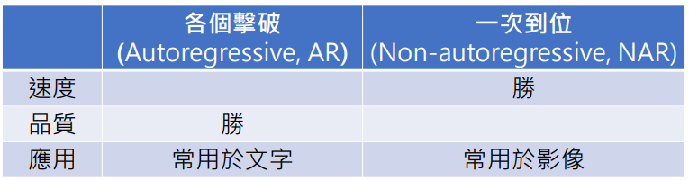

# 李宏毅机器学习

## 正确认识ChatGPT

- ChatGPT原理

    - ChatGPT 真正做的事：文字接龙
        - 通过监督学习和自行查找（自监督）获得函数$f$
        - 
    - 自监督学习（预训练）
        - 

- ChatGPT带来的研究问题

    - 如何精准提出需求
        - 提示词工程 Prompting
    - 如何更正错误

- ChatGPT × Midjourney → AVG

## 机器学习基本概念介绍

- 概念：得到一个函数 f ，通过调整输入得到 f 的输出
	- 
- 按输出分类：
    - 回归（Regression）：输出一个数值
    - 分类（Classification）：输出一个类别（选择题）

- Structured Learning
	- 又称生成式学习(Generative Learning)
	- 得到函数 f 的步骤：
		- 前置：决定要找什么样的函数
		- 设定范围：设定不同候选函数的集合（Model)
			- 即CNN、RNN等神经网络结构
			- 
		- 设定标准：设定评价函数好坏的标准（Loss）
			- 
			- 
		- 达成目标：找出最好的函数-最佳化（Optimization）
			- 
    - 
    - 

- 生成式学习的两种策略
    - 生成有结构的复杂内容
        - 文本：由token组成（token：中文的字，英文的word piece）
        - 图片：像素
        - 语音：取样点
    - 策略一：各个击破
        - 
    - 策略二：一次到位
        - 
    - 对比
      - 
      - 
    - 结合
        - 
        - 或把一次到位变成 n 次到位（diffusion）

