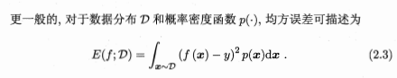

# 机器学习

## 基本术语

data set：数据集
sample/instance：样本/示例
attribute/feature：对象某个属性
attribute value：属性值
attribute space/sample space：样本空间/输入空间，属性张成的空间
feature vector：空间中示例对应的特征向量
$m$ 个示例的数据集 $D=\{x_1,x_2,...,x_m\}$ , 每个示例有 $d$ 个属性 $x_i=(x_{i1};x_{i2};...;x_{id})$ 

label：标记，关于示例结果的信息
label space：标记空间/输出空间，所有标记的集合
example：样例，$(x_i,y_i)$ 表示第 $i$ 个样例，$y_i$ 是示例 $x_i$ 的标记

classification：分类，预测离散值
regression：回归，预测连续值
clustering：聚类，将训练集分成若干组，每组称为一个簇(cluster)

supervised learning：监督学习
unsupervised learning：无监督学习（根据是否有label区分）
generalization：泛化，模型适用于新样本的能力，机器学习的目标

## 模型评估与选择

### 误差(error)

训练集上的误差：训练误差
新样本上的误差：泛化误差
测试集上的误差：测试误差，作为泛化误差的近似

过拟合（overfitting）
欠拟合（underfitting）

### 评估方法

- 留出法(hold-out)
    将数据集D划分为训练集S和测试集T，在S上训练模型过后在T上评估测试误差。

- 交叉验证法(cross validation)
    先将D划分成k个大小相似的互斥子集，每次用k-1个训练，用1个测试，重复k次取均值，称为k折交叉验证(k-fold cross validation)
    - 留一法(LOO)：特例，D中有m个样本，令k=m，计算开销更大但更准确

### 性能度量

- 均方误差(MSE)
    $E(f;D)=1/m·\Sigma_{i=1}^m(f(x_i)-y_i)^2$ 
    
- 错误率
    
    
- 精度
    $acc(f;D)=1-E(f;D)$
- 混淆矩阵
    
- P-R曲线：查准率-查全率曲线
    平衡点是 $P=R$ 时的取值
    - F1 score：$F1 = 2·P·R/(P+R)=2·TP/(样例总数+TP-TN)$ 
        
- ROC图和AUC值
    
    

## 线性模型

给出示例 $x=(x_{1};x_{2};...;x_{d})$ ，线性模型试图通过学习得到一个函数 $f(x)=w_1x_1+w_2x_2+...+w_dx_d+b$ 

向量形式：$f(x)=w^Tx+b$ 

### 线性回归(linear regression)


目的：确定w和b
方式：最小化均方误差


多元线性回归：


### 对数几率回归

对于二分类问题 $y=\{0,1\}$ , 线性回归模型产生的预测值 $w^Tx+b$ 为实值，需要将其转化为0/1值

- unit-step function：单位阶跃函数，大于零判为正例，小于零反例；缺点：不连续

- logistic functon：逻辑斯蒂函数，“Sigmoid函数”之一，将 $w^Tx+b$ 转化为接近0或1的 y 值：
    
    
    

    - 极大似然法（maximum likelihood）
        给定数据集 $\{(x_i,y_i)\}_{i=1}^m$ 
        最大化对数似然函数
        
        转化为最小化负对数似然函数求解

        
        

### 线性判别分析(LDA)

给定训练样例集，设法将样例投影到一条直线上，使得同类样例的投影点尽可能接近、异类尽可能远离，对新样本分类时，将其投影到同样的这条直线上，根据投影点位置确定新样本类别。


### 多分类学习

拆成若干个二分类问题


- 将C1~C4取不同正例/反例，然后训练出对应的 f ，再用 f 预测结果，训练时取的label与预测结果最接近的就是预测的分类。
- 海明距离就是不同位的数量，欧氏距离是看作是坐标，算坐标距离。
    - 海明距离意义下理论最优的ECOC二元码：类与类间最小海明距离最大化
- 三元码就是增加了不使用样本的label

## 决策树

### 划分选择

- 引入
    

- 信息熵(information entropy)
    
    Ent(D)的值越小，D的纯度越高

- 信息增益
    
    一般信息增益越大，使用属性a来进行划分获得的"纯度提升"越大
- 例：
    
    
    
    
    

- 增益率(gain ratio)
    

- ID3算法构造决策树
    ```python
    #假设数据集为D，标签集为A，需要构造的决策树为tree  
    def ID3(D, A):  
        if D中所有的标签都相同:  
            return 标签  
        if 样本中只有一个特征或者所有样本的特征都一样:  
            对D中所有的标签进行计数  
            return 计数最高的标签  
        计算所有特征的信息增益  
        选出增益最大的特征作为最佳特征(best_feature)  
        将best_feature作为tree的根结点  
        得到best_feature在数据集中所有出现过的值的集合(value_set)  
        for value in value_set:  
            从D中筛选出best_feature=value的子数据集(sub_feature)  
            从A中筛选出best_feature=value的子标签集(sub_label)  
            #递归构造tree  
            tree[best_feature][value] = ID3(sub_feature, sub_label)  
        return tree  
    ```

    

### 剪枝处理

> 决策树对付过拟合的主要手段

- 预剪枝：决策树生成时对每个结点在划分前估计
- 后剪枝：训练集生成完整决策树后自底向上对非叶节点考察能否将子树替换成叶子节点

### 连续与缺失值

- 连续属性离散化：将 $D$ 分为子集 $D_t^-$ 和 $D_t^+$ ,  $D_t^-$ 表示在属性 a 上取值不大于 t 的样本
    
- 缺失值处理：为每个样本 $x$ 赋予一个权重 $w_x$ ，定义
    
    

### A better tree

- Small trees
    $EPE(f) = (bias)^2+variance+noise$

## 支持向量机

对于一个样本集D的分类问题，我们希望找到一个划分超平面，但无法确定哪一个，如下：


划分超平面可表示为 $w^Tx+b=0$ ，样本空间中任一点 $x$ 到超平面 $(w,b)$ 的距离为 $r=\frac{|w^Tx+b|}{||w||}$ 


### 拉格朗日乘子法


### 核函数

得到对偶问题(6.11)后：


