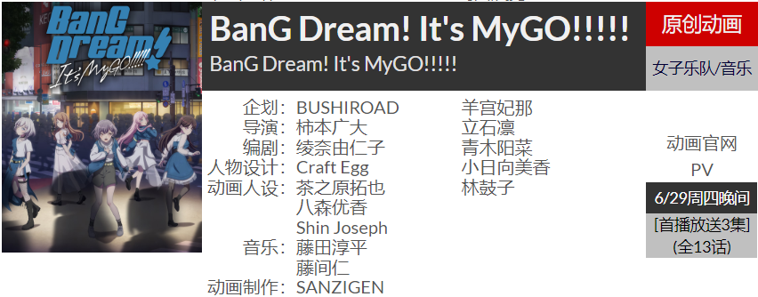

# Welcome to moyuke's notebook

## About

!!! note "" 
      
    

        ~🚧施工中……~
    

    

        (～￣▽￣)～
    

      

!!! abstract "Content"
	* note of CS courses
	* note of general education
	* some projects

!!! advice inline end "相关链接"
    

    

        [:fontawesome-brands-github:](https://github.com/moyuke) [GitHub](https://github.com/moyuke)
		[:fontawesome-solid-blog:](https://lesteryu.blog.luogu.org) [luogu](https://lesteryu.blog.luogu.org)
    

    

!!! note ""
    

        **🚩本季新番推荐**
    

    <figure markdown align="center">
    { width="400px" }
    <figure>
    
!!! note ""
    前段时间整理旧物时，翻出小学时写作的侦探小说，在毕业前，我写下了下一个案件故事的预告，约定毕业后的某天更新，但是那本小说就在这里断章，因为曾经相约的读者随着毕业与我失去了联系。初中时拉了一个小团体的群，大家每周都在群里聊天，我也是什么都往群里搬，但一毕业，小群很快就销声匿迹，只剩群机器人偶尔会发一条生日祝福之类的东西。高中虽然很苦，但大家有说有笑，每晚回寝室都能和几个人夜聊很久，当时多么希望这段日子能够一直持续下去，甚至幻想毕业后做个语音插件，寝室的几个人依旧在晚上夜聊，分享自己的经历，但现在毕业两年多了，我们连一点交流都没有。到了大学，本想开启新的社交，与新朋友交心，大一满心期待进了一个社团，但在社团里的日子从来没有开心过，和谈笑风生的他们总觉得隔了一层厚障壁，到头来，自己只不过是戴上了一层面具，强迫着自己社交罢了，社团结束，大二一年能说上话的只剩下了寝室四人，但知音不觅，也没有高中夜聊那般的欢愉了。斗胆进了几个群，但也是除了+1什么都不敢点，只是看着群友聊天——哪怕能这样看着也好，如果群友们能一辈子一起聊天，聊动画，聊游戏，聊工作，聊生活，一辈子这样聊下去的话……该有多好。但我知道，一辈子什么的都只是空话，没有什么是永恒不变的，那些曾经以为的永远都随着时间的推移变成了过往的云烟。