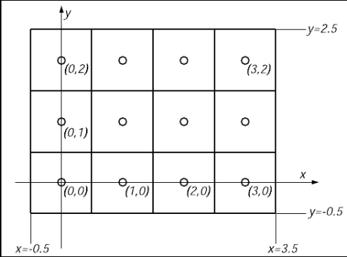
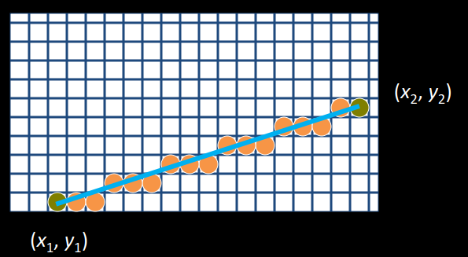
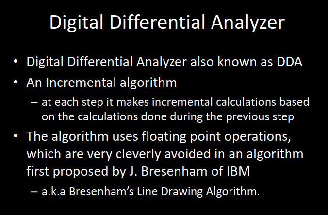
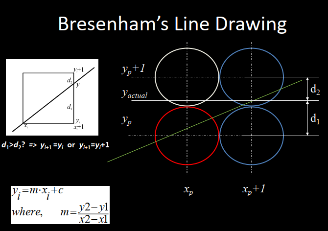
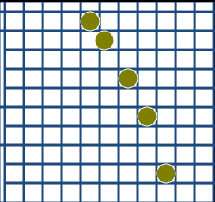
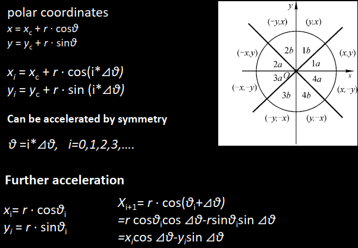
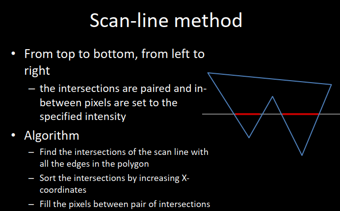
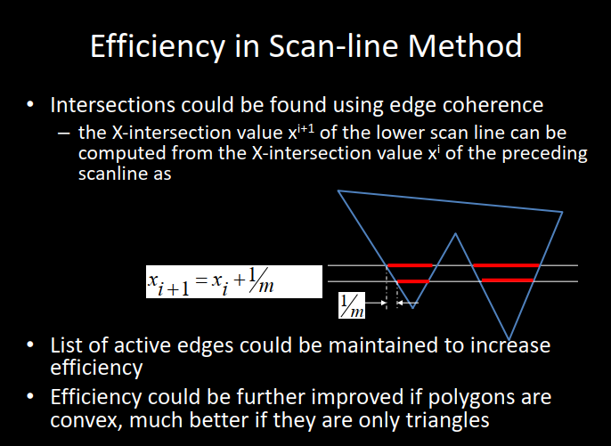
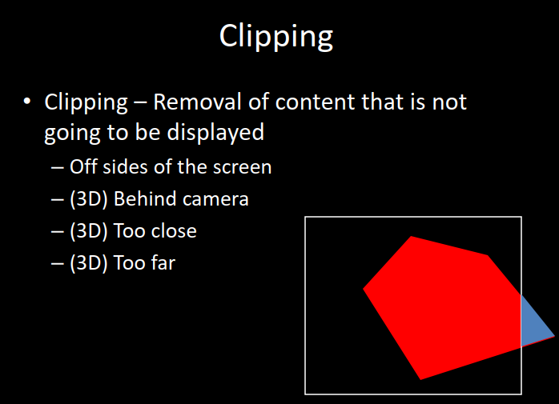
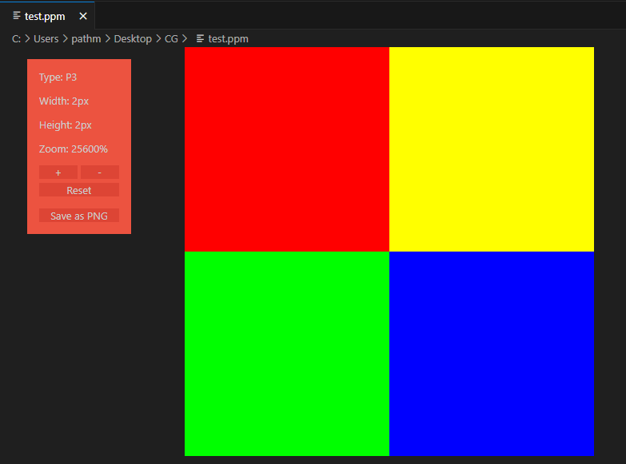

# # 1 How to draw 2D Graphics

## Rasterization 光栅化

将几何信息转化为像素的过程。

## Coordinate System



## line

- start from (x1, y1) end at (x2, y2)  

- 

- Solve：得到直线方程 $y=mx+c$ ，再对每一个x求出y并rounding，最后把对应的（x，y）染色。

- 注意：控制0<=m<=1，若反之，则更换因变量，变成 $x=my+c$ 这种。

- 加速：求出斜率m，x增加1时，y增加m

    

	

- 判断出什么时候y要+1，然后只需要在+1的位置将染色的格子上移一格即可。

- Bresenham画线算法
    - $0<=m<=1$，且 $x_2 > x_1$ 
    - 设在第 i 步已经确定 $(x_i, y_i)$ ，在 i + 1 步：
    - $d_1 = y-y_i = m(x_i+1)+c-y_i$ 
    - $d_2 = y_i+1-y = y_i+1-m(x_i+1)-c$ 
    - $d_1 - d_2 = 2m(x_i+1)-2y_i+2c-1$ 
    - 若 $d_1>d_2$ ，下一个像素点取 $(x_i+1,y_i+1)$ 
    - 若 $d_1<d_2$ ，下一个像素点取 $(x_i+1,y_i)$ 

## circle

- 套用直线画法的问题：直线可以控制0<=m<=1，但曲线不能，因此会导致不论以x做自变量还是以y做自变量，都会有部分线不连续，出现断点：

    ****

- Solve：极坐标，然后以 $\theta$ 作为自变量。

    

## Polygon Filling

- Solve1：测试每一个像素是否在多边形内。

- Solve2：扫描线

    

    

- Solve3：Seed Fill

    

- Solve4：Clipping

    

    

## Lab

- 输入数据，输出PPM图像。

!!! note "PPM"
	- ppm格式是一种图片格式，全名 Portable PixelMap
	- 对于一个PPM格式的文件，我们先要声明他的类型(p3/p6)
		e.g.
		```
        P3
        # ./test.ppm
        2 2
        255
         255   0   0 
         255 255   0   
           0 255   0    
           0   0 255
        ```
        得到这样的图片:

- Helper Code：

    ```c++
    void ppmWrite(const char* filename, unsigned char* data, int w, int h) {
    	FILE* fp;
    	fp = fopen(filename, "wb");
    
    	fprintf(fp, "P6\n%d %d\n255\n", w, h);
    	fwrite(data, w*h * 3, 1, fp);
    
    	fclose(fp);
    }// 将data数组的颜色输出为PPM格式
    
    int main() {
    	unsigned char data[400*300*3] = { 0 };
        // 400*300的RGB图，初始为黑色
    	ppmWrite("test.ppm", data, 400, 300);
    	return 0;
    }
    ```

- Ellipse
    $$
    x=x_c+a*cos\theta\\
    y=y_c+b*sin\theta
    $$
    

    ```c++
    #define _USE_MATH_DEFINES
    #include <cmath>
    #include <cstdio>
    #include <cstring>
    #define width 400
    #define height 300
    
    unsigned char data[width * height * 3] = { 0 };
    
    void draw(int x, int y){
    	if(x < 0 || x >= width || y < 0 || y >= height) return;
    	data[(width * y + x) * 3 + 0] = 0;
    	data[(width * y + x) * 3 + 1] = 0;
    	data[(width * y + x) * 3 + 2] = 0;
    } // draw pixel (x,y)
    
    void ellipse(int Cx, int Cy, int Ra, int Rb, double Theta){
    	double pi = M_PI;
    	double d = 0.001;
    	Theta = Theta * M_PI / 180.0;
    	// DEGtoRAD
    	for(int i = 0; i * d <= pi; i++){
    		double xt = Ra * cos(i * d);
    		double yt = Rb * sin(i * d);
    		// base coordinate for Theta = 0
    		int x = (int)(xt * cos(Theta) - yt * sin(Theta) + Cx);
    		int y = (int)(- xt * sin(Theta) - yt * cos(Theta) + Cy);
    		// rotate the ellipse
    		draw(x, y);
    		draw(2 * Cx - x, 2 * Cy - y);
    		// draw two symmetrical points
    	}
    } // draw an ellipse
    
    int main() {
    	memset(data, 255, sizeof(data));
    	int Cx, Cy, Ra, Rb;
    	double Theta;
    	printf("Input 5 numbers in order: Center(x, y), Ra, Rb, Theta\n");
    	scanf("%d%d%d%d%lf", &Cx, &Cy, &Ra, &Rb, &Theta);
    	ellipse(Cx, Cy, Ra, Rb, Theta);
    	ppmWrite("test.ppm", data, 400, 300);
    	return 0;
    }
    ```

    

