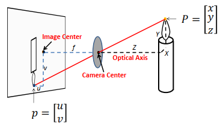
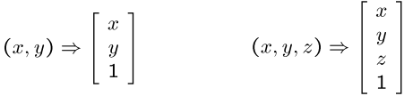
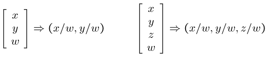
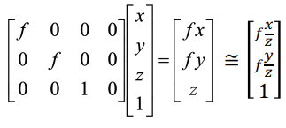
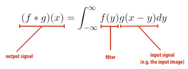
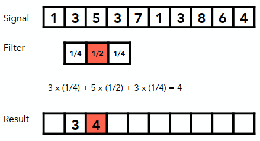
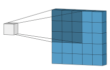
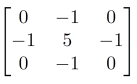
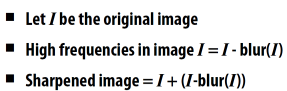
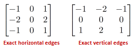

# 计算机视觉导论

## Image formation

>Geometric image formation(几何成像)

- Pin-hole camera model
    

- Converting to homogeneous coordinates(齐次坐标)
    
- Converting from homogeneous to Cartesian(笛卡尔数)
    
- Perspective Projection(透视投影)
    

## Image processing

### Basics

- 常见图片处理：increase contrast，Blur，Sharpen，Edge detection

- Convolution(卷积)
    
    
    - 2D Convolution
        
- Sharpen
    - 卷积核(例子)：
        
    - Sharpening is add high frequencies
        
- What does convolution woth these filters do?
    

## Model fitting and optimization

