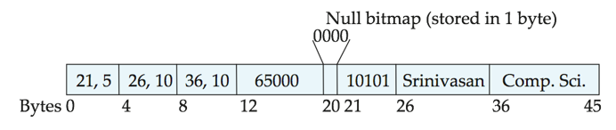
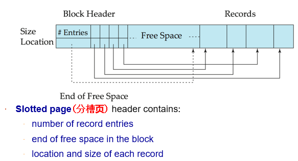
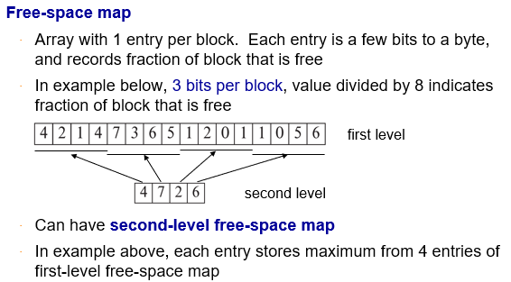
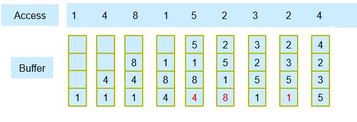

# 数据存储结构

## 记录类型

* 数据库文件存在磁盘里，文件由记录(record)组成，record由各个字段(field)组成

* 定长记录(Fixed-Length Record)，可以计算每个block可以放多少记录

  * 存record i：若长n byte，从n*(i-1) byte开始
  * 删除：不移动 record，记为空记录
    * 空记录设指针指下一个空的record
    * 头部加上header指向第一条空记录

* 不定长记录(Variable-Length Record)

  * 原因：有不定长字符串，有空字段
  * 方法：不定长的全放后面，用(offset,length)记录位置和长度
  * 
  * Null bitmap：有几个属性就有几位，0表示非空，1表示空
  * 
  * 插入：指针+长度存记录位置，在free space从后往前插入
  * 删除：相对地址，block_num + index

## Record组织规则：

  * 堆：
    * 
    * 维护空闲块的map，记录空闲程度：7即7/8的空闲
  * 顺序 Sequential
    * 插入：插到中间会导致后面的记录全体后移，因此直接放在最后，通过指针串联
      * 每个一段时间按顺序重整（克服碎片化）
  * B+树
  * 哈希

## 存放方式：

  * 按行存放
  * 按列存放：cache命中率高

## 缓存管理 Buffer manager

  * 缓存替换：
    * LRU策略（Least Recently Used）最近最少用到
    * 
    * 在for循环等场景，LRU可能是一种坏策略
  * 若访问的block不在缓存，读出到缓冲区
  * 访问请求时，钉在(pin)缓冲区，请求为读时加共享锁，写时加exclusive lock

## 随堂测试

  * What is contained in the header of slotted page? 

    多选题 (1 分)

     A.number of record entries

     B.end location of free space in the block

     C.location of each record

     D.size of each record

     E.primary key of each record

    正确答案: A B C D

  * What kind file organization is suitable for applications that require sequential processing of the entire file? 

    单选题 (1 分)

     A.heap file organization

     B.sequential file organization

     C.multitable clustering file organization

     D.hash file organization

    正确答案: B

  * Which statement is incorrect?

    多选题 (1 分)

     A.For heap file organization, records can be placed anywhere in the file where there is free space.

     B.Database system seeks to minimize the number of block transfers between the disk and memory. 

     C.If the needed block is not in the buffer, the buffer manager will replace some other block, if required, to make space for the new block.

     D.LRU is the most suitable replacement strategy for buffer manager in any cases.

    正确答案: D

  * For the buffer manager, there are following assumptions:

    • There are 4 buffer pages.

    • Initially the buffer is empty occupied.

    • The data access sequence is 1,2,3,4,5,4,3,2,1,3,5

    According to the LRU replacement strategy, there are    1    times replacements occurred,  and the data item    2    is the least recently used after completing the above data access sequence.

    填空题 (1 分) (请按题目中的空缺顺序依次填写答案)

    正确答案:

    1：3

    2：2