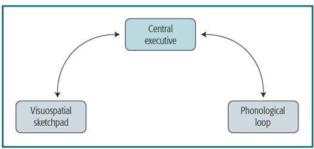
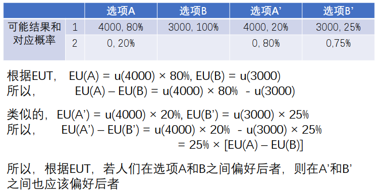

# 设计认知

## 概论

- 认知(Cognition) 
    - 指在了解、学习和理解事物的活动中发生的心智过程。
- 设计认知概论
    - 狭义：设计活动的认知过程及其规律
    - 广义：所有与设计有关的认知过程及其规律
    - 前者考察设计者，后者同时考察使用者 
- 认知心理学和认知科学
    - 认知心理学是探讨心智(mind)如何被组织从而产生智能思维，以及心智如何在脑中实现的科学
    - 认知科学是从多学科交叉的角度，对人和智能机器的心智进行的科学研究，涉及哲学、心理学、神经科学、语言学、人工智能、机器人学 。
    

- 认知视角下的设计活动

    - 设计是一种特殊的问题解决活动
        - 设计中需要解决的问题一般缺乏明确定义
    
        - 设计的目的是找到令人满意的，而非最优的解决方案
    
        - 设计活动以解决方案而非问题为焦点
    
        - 问题和解决方案在设计活动中是协同共进的
    
    - 创造力在设计活动中具有核心价值
    
    - 新手和专家设计师具有不同的认知策略
    
- 认知视角下的使用体验

    - 设计产品的使用体验取决于使用者的认知规律
    - 为了提高设计质量，了解使用者的认知规律和了解设计者的认知规律同等重要
    - 优秀的设计应当秉持使用者中心原则

## 认知心理学概论

- 基础认知
    - 知觉、注意、心理表象、知识表征、记忆
- 高级认知
    - 问题解决、专业技能学习、推理、判断与决策、语言理解
    
- 信息加工视角下的认知心理学
    - 广义而言，认知心理学涉及所有关于人类认知过程的科学研究
    - 狭义而言，认知心理学是指以信息加工的视角对人类认知过程进行的科学研究
    - 根据信息加工范式，人类的认知是由一系列信息处理过程组成的，包括输入，编码、转换和输出等步骤
    - 信息加工视角下的认知心理学将人类的认知类比于计算机对于信息的加工处理
- 认知神经科学(cognitive neuroscience)
    - 认知神经科学探讨认知功能在人脑中的实现方式
    - 神经元(neuron)是信息编码的基本单元
    - 神经元相互之间通过突触(synapse)进行联系和交流
    - 信息通过网络化的神经元的活动模式来表征  

- 脑与认知
    - 脑由不同的区域组成，各区域执行不同类型的功能
        - 布罗卡区（Broca’s area）和威尔尼克区(Wernicke’s area)（语言）
        - 海马(hippocampus)（记忆）
        - 前额叶(frontal lobe)（执行控制）
        - 基底神经节(basal ganglia)(运动、复杂认知控制）
        - 顶叶(parietal lobe)(空间加工，身体表征）
    - 功能的偏侧化
        - 左脑语言优势
        - 右脑动作优势  

## 知觉

> 知觉是从感觉输入到模式识别的过程

- 深度知觉
    - 深度知觉涉及将视网膜上的二维信息转变为三维空间表征的过程
    - 深度知觉的线索包括
        - 纹理梯度（单眼）
        - 运动视差（单眼）
        - 立体视觉（双眼）
- 物体知觉
    - 物体知觉涉及将简单视觉特征组合起来感知为物体的过程
    - 格式塔组织原则
        - 接近原则
        - 相似原则
        - 良好连续原则
        - 闭合原则
- 视觉模式识别
    - 模板匹配
    - 特征分析
- 自下而上和自上而下加工
    - 知觉既取决于直接物理刺激（自下而上加工），又受到情境信息以及一般性知识的影响（自上而下加工）

## 注意

- 顺序瓶颈(serial bottleneck)
    - 注意涉及对于信息加工对象的取舍
    - 顺序瓶颈是注意的前提
    - 早期选择理论vs.后期选择理论
    - 目标导向注意vs.刺激驱动注意
- 听觉注意
    - 双耳分听任务
    - 未注意通道的信息加工
    - 目标导向加工vs.刺激驱动加工(鸡尾酒会效应）
    - 基于物理特征或者语义的注意机制
    - 过滤器理论vs.衰减理论

- 视觉注意
    - 中央凹加工区域一般也是注意的焦点
    - 注意焦点与中央凹加工区域可以分离
    - 注意的转移通常发生在相应眼动之前

- 视觉搜索

    - 对于复杂物体的搜索往往需要对视野中的所有对象

    - 但是当搜索对象具体独特特征时，往往会在视野中跃出(pop-out)  

- 基于物体的注意
    - 视觉注意既可以指向空间位置，也可以指向物体
    - 返回抑制现象及相关研究
    
- 中枢注意

    - 研究1：呈现包含3个数字的数字串，如”3 4 7”, 并要求被试同时完成
      
        - 任务1：判断前两个数字之和是否等于第三个数字。如是，用右手食指按键，如不是，用左手食指按键
        
        - 任务2：口头报告第一个数和第三个数的乘积
        
    - 研究2：被试同时看屏幕上的单个字母和听一个纯音
      
        - 任务1：根据字母出现在屏幕的左边、中间还是右边，相应地按下左键、中键或者右键
        
        - 任务2：根据声音是低频、中频还是高频，报告1,2,或者3
        
    - 人们能够同时加工不同模态的知觉信息，也可以同时完成不同运动系统的动作，但是无法在单一系统里同时加工多件事情，包括中枢认知系统。
    
    - 练习可以降低任务对于中枢认知系统的需求，直至达到自动化。

## 心理表象

>心理表象(mental image)是指在没有外在知觉信息来源的情况下，
>对类似知觉信息的加工。 
>
>问题1：国歌歌词的第10个字是什么？
>问题2：玉泉校区一共有几个校门？  

- 言语表象和视觉表象
    - 问题1诱发言语表象
    - 问题2诱发视觉表象
    - 言语表象和视觉表象涉及不同脑区
        - J任务涉及与语言有关的布罗卡区（前额叶）和威尔尼克区（颞顶联合区）
        - R任务涉及与视知觉和注意有关顶叶、枕叶和颞叶皮层
    - 言语表象和视觉表象的加工方式也不相同
        
        
    
- 心理旋转
    - 心理旋转是一种对于视觉表象的加工
    - 其功能是预测物体在不同视角下呈现的样子  

- 表象扫描

    - 对物理视觉阵列的扫描会干扰对视觉表象的扫描

    - 刺激类型
        1：言语表象（名词）
        2：视觉表象（位置）

- 视觉表象类似于视知觉
    - 个体可以通过视觉表象进行心理加工，这是设计师的必要技能
    - 视觉表象中也会出现和视知觉错觉类似的现象
    - 视知觉研究中的可逆歧义图形在视觉表象中也可以逆转，虽然更加困难

## 知识表征

>知识：人类对物质世界和精神世界进行探索和提炼的成果
>
>知识表征：信息在人脑中的储存和呈现方式  

- 言语信息记忆
    - 人们加工言语信息后，通常只会记住其意义，而非确切措辞  
    
- 变化盲(change blindness)  、

- 视觉信息记忆
  
    - 我们对视觉信息的记忆能力往往强于言语信息
    
    - 但是，对于视觉信息，记住的往往依然是它的含义，而非确切内容  
    
- 细节与意义的保持
    - 知觉细节在初始阶段会得到编码，但是很快会遗忘
    - 相反，意义能够长久保持  
    
- 类别知识
    - 人们往往根据类别来理解信息
    - 类别知识有助于预测
    - 类别知觉也会带来刻板印象
        - 伊丽莎白在得知她的数学SAT成绩时并未感到特别惊讶
        - 鲍勃在得知他的数学SAT成绩时并未感到特别惊讶
    
- 概念知识
    - 语义网络(Semantic network)
        - 当一个属性不直接储存在某个概念中时，人们可以通过更高层次的概念来提取它
        - 如果频繁经历到概念的某个事实，它就会储存在这个概念中，即使它可以从更高层次的概念推论出来
        - 概念的某个事实出现得越频繁，他与这个概念之间的联系就越紧密，核实也就越迅速
        - 判断不直接储存在概念中的事实需要花费较长的时间
            
        
    - 图式(schema)
        - 图示概念最早出现于AI和CS领域，且相比语义网络更适合于类别知识表征
        
        - 图式的插槽(slot)结构(概念的属性及属性值），例如
            - 房子的图示包含以下属性和属性值
              
                • 上属：建筑物
                
                • 组成：房间
                
                • 材料：木头、砖块、石头
                
                • 功能：供人类居住
                
                • 形状：直线，三角
                
                • 大小： 10-1000平方米
            
        - 属性一般含有默认值，但很少绝对禁止其他可能值
        
        - 图示还有一种结构，称为组成层次

## 记忆

> 记忆遵循幂定律

- 感觉记忆
    - 感觉记忆短暂地保存信息
    - 视觉感觉记忆
        - 全部报告法
        - 部分报告法（音频提示）
    - 听觉感觉记忆

- 短时记忆
    - 短时记忆是信息从感觉记忆进入长时记忆的中介阶段
    
    - 感觉记忆通过注意进入短时记忆
    
    - 短时记忆通过复述进入长时记忆

        
    
    - 影响复述效果的关键因素是信息加工深度而非时间长短
    
- 工作记忆
    - 工作记忆和短时记忆类似，但不涉及长时记忆，而是更强调对信息的即时操作以及信息保持对完成任务的作用。
    
    - 组成成分包括
        - 视觉空间画板
        
        - 语音环路
        
        - 中枢执行系统
          
            
    
- 长时记忆
    - 长时记忆是永久储存信息的记忆单元
    - 从长时记忆中提取信息的速度和可能性取决于记忆的激活水平
    - 记忆的激活水平取决于基线激活水平和从相关概念获得的激活
    - 启动项目引起的激活可以通过网络扩散到与启动项目相关的记忆

- 练习与记忆强度
  
    • 频繁的使用和练习能够增强记忆项目的基线激活水平
    
    • 学习的幂定律
    
    
    
- 记忆的遗忘
  
    • 有些看似遗忘的信息，其实仍然存储在记忆中。相关证据既出现在配对联想研究中，也出现在再认研究中

    • 有些信息的确是被遗忘了，且信息的保持函数也呈现幂函数形式  
    
- 记忆影响因素
    - 增细加工(elaborative processing)是指创建与需要记忆的事物有关且对它有所补充和扩展的额外信息，此类加工可以提升记忆效果。
    - 在加工材料的方式相同的前提下，比如涉及相同的增细加工时，伴随学习和有意学习都可以促进记忆。

- 干扰影响记忆
  
    • 学习一个项目的新关联对象，会导致对旧关联对象的遗忘

    
    
- 冗余抑制干扰
  
    • 学习冗余材料不会干扰目标记忆，甚至会增强目标记忆
    
    • 单一事实组：牛顿变得像小孩一样情绪多变（目标）

    • 无关事实组：洛克在威斯敏斯特做学生时一点也不开心（目标）；洛克觉得水果有害儿童健康（无关事实）
    
    • 相关事实组：莫扎特从慕尼黑跋涉到达巴黎（目标）；莫扎特为避开恋爱纠葛而打算离开慕尼黑（冗余事实）  
    
- 提取和推断
  
    • 在提取记忆时，往往存在推断过程
    
    • 推断的内容可能被记忆为实际学习过的内容
    
    • 当推断的内容看上去是真的时，间隔时间越长，提取速度越快
    
    • 学习时的增细加工，既可以增加记忆绩效，也会让人回忆起那些没学过但是自己推断出的内容。 
    
     
    
- 联想结构和提取
  
    • 编码情境效应
    
    • 心境一致效应
    
    • 状态-依存学习
    
- 内隐（非陈述性）和外显（陈述性）记忆 

    

## 问题解决

- 问题解决的特征
  
    • 目标导向
    
    • 子目标分解
    
    • 算子应用
    
- 问题解决的过程
  
    • 问题解决通常可视作一个问题空间搜索的过程
    
    • 问题空间：问题的各种不同状态
    
    • 状态：处于某一解决程度时问题的表征，包括初始、目标和中间状态
    
    • 算子：将某一问题状态转化为另一问题状态的动作  
    
- 算子的习得
  
    • 发现（观察或者尝试，自我学习）
    
    • 他人告知（社会学习）
    
    • 案例学习（社会学习）
    
- 霍比特人与半兽人问题
    在河的一边有三个霍比特人和三个半兽人需要过河。他们有一条船，一次最多载两人过河，且每次船到岸边，船上的人都必须全部下船，才能再上人。目标是让所有六个人都过河，但是任何时候在河的任意一边，半兽人数量都不可以超过霍比特人的数量，否则半兽人会吃掉霍比特人。请问应该如何让这些人过河？
    
    
    
- 算子的选择
  
    • 回溯规避(backup avoidance)：避免采用消除先前算子效果的算子
    
    • 差异降低(difference reduction)：减小过渡状态和目标状态间的差异
    
    • 手段-目的分析(means-ends analysis)：创建子目标以消除阻止应用所需算子的差异  
    
- 手段-目的分析
    

- 功能固着
  
    • 在问题解决过程中，人们对于特定物品往往只能想到特定的功能，而忽视了其他可能性  
    
- 定势效应
  
    • 在解决问题时，人们会受到经验的影响而倾向于选择特定算子。  
    
- 酝酿效应
  
    • 有时苦思冥想而得不到解决的问题，搁置一段时间后，反而能够轻而易举地解决。
    
    • 这种酝酿效应往往是因为定势效应的消退引发的
    
    • 便宜项链问题  
    
- 顿悟
  
    • 顿悟并非是在某一时刻突然发现了问题的解决方案，而是在之前的思考过程中已经接近了解决方案而不自知。
    
    • 问题解决方案的关键因素，往往在顿悟体验之前很久就已经想到了，例如对于残缺棋盘问题中每块多米诺骨牌必然覆盖不同颜色的棋盘格。  

## 专业技能学习

> 技能学习同样遵循幂定律

- 技能学习的阶段
  
    • 认知阶段(cognitive stage)
    
    • 关联阶段(associative stage)
    
    • 自主阶段(autonomous stage)  
    
- 程序化
  
    • 程序化是把基于思考的陈述性知识转化为模式驱动的程序性知识的过程

    • 程序化是专业学习的本质，模式识别在其中起着关键性的作用  
    
- 技法学习
  
    • 技法学习是指学习解决一个问题或者一部分问题所需的动作序列的过程。

    • 技法学习往往是一个从寻找问题解决方案到回忆问题解决方案的过程  
    
- 策略学习
  
    • 相比技法学习，策略学习是一种更为全面的学习过程
    
    • 策略学习涉及把问题解决的过程组织起来以把握一类问题的一般结构
    
    • 因为不同领域有不同的问题结构，所以存在不同的最优策略和策略学习过程
    
    • 在物理学领域，策略学习可能涉及从向后推理到正确地向前推理的转变
    
    • 在计算机编程领域，策略学习则可能涉及从深度优先到宽度优先的过程
    
- 模式学习和记忆
  
    • 专家能够更有效地识别重复出现的要素和模式，并知道如何快速应对

    • 专业技能也意味着能够在长时记忆中保存更大和更多的模式  
    
- 有目的学习的作用
  
    • 练习是专业技能学习的基础
    
    • 但简单的练习并不能保证习得专业技能
    
    • 有目的学习(deliberate practice)才是关键，包括学习动力，学习反馈、深度加工和增细加工  

## 推理

- 推理类型
    - 演绎推理(deductive reasoning)是由前提得到必然性结论的推理，是从一般到特殊的推理，例如： 所有的哲学家都读过书，笛卡尔是一个哲学家，所以笛卡尔读过书。
    - 归纳推理(inductive reasoning)是由前提得到或然性结论的推理，是从特殊到一般的推理，例如： 老鹰会飞、喜鹊会飞、天鹅会飞，所以所有的鸟类都会飞。
    - 溯因推理(abductive reasoning)是由经验到的事实集合反推出原因或者最佳解释的推理过程，例如地面是湿的，而且行人打着伞，所以天正在下雨。  

- 对条件命题的推理

    - 条件命题是一个包含“如果”部分和“那么”部分的断言，“如果”部分叫做前件(antecedent)，“那么”部分叫做后件(consequent)。
      
    - 有效推理：由肯定前件推论出后件为真，由否定后件推论出前件为假。
    - 无效推理：由否定前件推论出后件为假，由肯定后件推论出前件为真。
        - 条件命题：如果安然理解这篇论文，那么她会做一个不错的报告
        - 肯定前件：安然理解这篇论文；因此，她做了一个不错的报告
        - 否定后件：安然做了一个差劲的报告；因此，她不理解这篇论文  
    
- 直言三段论
  
    - 直言三段论(categorical syllogism)是涉及如下逻辑量词的演绎推理：一些、所有、没有、一些没有。
    
        > 没有男人是女人
        > 所有女人都是人
        > 所以，没有男人是人  
    
- 加工解释
  
    - 人们可能不是根据演绎逻辑的规则去判断结论是否为真，而是根据其他信息判断结论是否为真
    
        > 所有的律师都是人
        > 所有的共和党人都是人
        > 所以，一些律师是共和党人  
    
- 心理模型理论
  
    - 人们可能会创建一个满足三段论前提的关于世界的心理模型，然
        后检查结论是否符合这个模型，从而判断结论的正确性
    
        > 所有的方形都有条纹
        > 一些有条纹的物体有粗边界
        > 所以一些方形有粗边界  
    
- 归纳推理与假设检验
  
    - 假设形成涉及特征识别(attribute identification)和规则学习(rule learning)两部分
    
    - 特征识别是指发现与概念或者规则有关的特征
    
    - 规则学习是指发现将特征联系起来的规则  
    
        > 序列中第一个数是1，第二个数是2，第三个数是3，请问由此可
        > 得出什么有关所有序列元素的结论？  
    
- 沃森任务和证实偏向
  
    - 人们在检验假设时，往往倾向于生成正性案例

## 判断与决策

- 概率判断和贝叶斯定理
  
    • 贝叶斯定理是根据证据（数据）对信念进行调整进而推断事件概率的规范模型
    
- 贝叶斯定理
  
    
    
    
    
- 基于经验的概率判断
  
    - 当信息以逐个经历的方式被学习时，人们的行为和贝叶斯定理的要求较为接近（外显vs内隐）
    
    - 医疗诊断示例
      
        • 256个病人
        
        • 4种可能症状（鼻出血、胃痉挛、眼肿胀、牙龈发白）
        
        • 15种可能症状模式
        
        • 2种疾病（3:1）
        
        
    
- 自然频数有利于正确的概率判断
  
    
    
- 概率判断
  
    - 人们往往根据是否容易想到对应的例子，来进行概率判断，即使用可得性启发式
    
        > 请你估计一下，以字母“k”开头的英语单词在所有英语单词里所占的比例。
        > 请你估计一下，第三个字母是“k”的英语单词在所有英语单词里所占的比例。  
    
    - 人们倾向于根据事件序列的代表性，或者说和其他序列的相似性，来进行概率判断
    
        > 当投掷一枚正常的硬币时，以下两种序列哪个出现的可能性更大?
        >
        > 
    
- 再认(recognition)启发式  
    - 请问以下各对德国城市中，哪座城市的人口更多
      
        • 柏林 vs. 汉堡
        
        • 柏林 vs. 慕尼黑 
        
        • 慕尼黑 vs. 汉堡  
        
    - 当两个对象一个可以再认(recognize)而另一个无法再认时，人们倾向于判断可再认的城市拥有更多的人口
      
        • 上述判断方式具有适应性，因为再认与否和城市人口规模存在相关
        
        • 对于报纸信息的统计表明，城市出现频率和实际大小有强烈的相关
        
        • 请问，相比于美国学生，德国学生在判断德国城市人口大小方面，会表现得更好还是更差？  
    
- 风险决策
  
    • 风险决策是指某些选择对象包含多种可能结果，且已知所有可能结果及其客观概率条件下的决策。
    
    • 如果各种可能结果，或者其客观概率在决策时未知，那么相应的决策被称为不确定条件下的决策。
    
    
    
- 风险偏好
  
    • 风险偏好指的是个体在多大程度上偏好风险更大而非风险更小的选项。
    
    • 风险偏好通常是根据人们在两个期望价值相同的选项间的偏好情况来定义的，这其中一个是安全选项，而另一个则是风险选项。
    
    • 因此，如果某人在选项A (100, 100%) 和选项B(500, 20%) 之间更喜欢选项A，那么就说他/她是风险规避的，反之，则为风险寻求。  
    
- 决策中的框架效应
    - 决策问题的表达方式会对决策过程和结果产生影响  
    
- 期望价值理论(expected value theory; EVT)
  
    • EVT假定，人们根据每个风险选项的客观价值的（数学）期望来进行风险决策
    
    • 选项A的期望价值 = 100元×100% = 100元
    
    • 选项B的期望价值 = 200元× 50% = 100元
    
    • 所以，根据EVT，人们在两者间应该无偏好  
    
- 圣彼得堡悖论(St. Petersburg paradox)
  
    • 设想以下赌局:收益大小由重复投掷硬币且连续出现正面的次数决定，具体关系为
    
    
    
    
    
- 期望效用理论(expected utility theory; EUT)
  
    • EUT认为，人们在评估每个风险选项时，考虑的是各选项**效用**的（数学）期望，且效用一般是客观价值的非线性函数
    
    • U(x): 效用函数，其中x为某一结果的客观价值
    
    • 选项A的期望效用 = u(100) × 100% = u(100)
    
    • 选项B的期望效用 = u(200) × 50%  
    
- 边际效用递减原理
  
    • 增加相同数量的收益或者消费带来的额外效用，会随着总收益或者消费的增加而减少
    
    
    
    
    
- 阿莱悖论1(Allais paradox I)
    
    
- 阿莱悖论2
    
    
- 前景理论
  
    • 前景理论(prospect theory; Kahneman & Tversky, 1979)，也可译作预期理论。该理论认为，在进行风险决策中，人们赋予每个可能结果的权重，一般会偏离对应的客观概率。
    
    • 根据前景理论，当一个前景同时包含零结果和至多两个非零结果时，其主观价值
    
    
    
- 价值函数
  
    • 就概念而言，个体层面的价值函数和经济学中的效用函数一样，表达的都是对于收益或者消费的价值或者有用性的主观判断
    
    • 但是，前景理论中的价值函数，是针对特定参照点进行定义的，一般是现状点，但也可以是其他对象，比如比较对象的状况
    
    • 经济学中的效用函数，则一般是针对总结果定义的
    
- 价值函数的数学形式
  
    
    
    
    
- 概率权重函数
  
    
    
    
    
    
    
    
    
    

## 使用者的认知

- 可发现性和可理解性
  
    • 可发现性(discoverability)：能否想到可能的操作，以及在哪里和如何操作

    • 可理解性(understanding)：产品应该如何使用，各种控件和设定意味着什么  
    
- 以人为本的设计
  
    • 符合使用者需求，易学易用，并且整体上带来愉悦的体验
    
    • 要分析使用者的需求、能力和行为方式
    
    • 使用者并不总是按照逻辑的方式行为，要考虑使用者可能出现的错误  
    
- 交互设计的基本原则
  
    • 可能交互(affordance)
    
    • 意符(signifier)
    
    • 映射(mapping)

    • 反馈(feedback)
    
    • 概念模型(conceptual model)
    
    • 约束(constraint)  
    
- 可能交互
  
    • 可能交互(affordance)是物理客体与人之间的一种互动关系，是客体的属性与使用者用来决定客体可以如何使用的能力之间的关系
    
    • 可能交互由物理客体的性质和使用者的能力共同决定
    
    • 椅子可以用于支撑，所以可以用来坐，可以坐就是椅子的一种可能交互

    • 普通的椅子常人可以举起，但是有些椅子只能由强壮的人或者一组人举起。这样的椅子对于体力较弱的人，就不具有可举起这种可能交互
    
    • 有些可能交互是可见的，有些是不可见的
    
    • 反示能(anti-affordance)意味着“示不能”，比如玻璃的“不能让空气或者大多数物体穿过”这一性质可以成为一种反示能，但仍需要使用者具有对应的能力去发现或者意识到这一性质  
    
- 意符
  
    • 意符(signifier)是提示可以如何采取行动的标志，比如一个门把手，或者诺曼门上的推拉标志
    
    • 在设计中，意符比可能交互更重要
    
    • 无意的意符可能变成明显的可能交互  
    
- 映射
  
    • 映射(mapping)是指两组事物元素间的关系

    • 良好的控制元件与效应器变化之间的映射关系是设计的基本要求  
    
- 自然映射
  
    • 自然映射(natural mapping) 是指通过空间类比的方式使得操纵方式容易理解的映射  
    
- 反馈
  
    • 反馈(feedback)是指让使用者知道系统正在对提出的需求做出回应
    
    • 反馈必须是即时的
    
    • 反馈必须提供信息
    
    • 过多的反馈适得其反
    
    • 反馈需要设置优先级  
    
- 概念模型
  
    • 概念模型(conceptual model)是对事物如何运作的高度简化的说明，比如电脑屏幕上的文件和文件夹图标就提供了相应的概念模型。
    
    • 正确的概念模型有助于使用者预测系统的行为
    
    • 在有用的前提下，概念模型不必做到完整甚至准确  
    
- 约束

    - 约束(constraint)是指对可能的操作集进行限制的强有力的线索

    - 四类约束
      
        • 物理的
        
        • 文化的
        
        • 语义的
        
        • 逻辑的  

- 系统映像
  
    • 系统映像(system image)是指使用者所能获取的产品信息的组合
    
    • 系统映像是使用者建立概念模型的基础

    • 设计师应该努力提供合理的系统映像，使得设计师和使用者拥有相同的概念模型  
    
- 情感化设计
  
    • 使用者对于设计产品既有实用的需求，也有情感化的需求
    
    • 认知和情绪活动是相互影响的
    
    • 情绪情感状态会影响个体的知觉、决策和行动
    
    • 有吸引力的东西更好用
    
    • 当使用者心情愉悦时，更有可能去探索产品的各种元素，思维也会更具有开放性，有利于发现正确的概念模型  
    
- 行动的七个阶段
    1. 形成目标
    2. 计划行动
    3. 明确行动序列
    4. 执行行动序列
    5. 感知环境状态
    6. 解释感知
    7. 比较结果和目标  

- 执行鸿沟和评估鸿沟
  
    • 执行鸿沟可以通过意符、映射、约束和概念模型来消除

    • 评估鸿沟可以通过反馈和概念模型来消除。  
    
- 人皆会犯错(To err is human)
    - 人在使用任何设计产品时都有可能犯错
    
    - 了解人类犯错的形式和根源，对于设计至关重要
    
    - “人为差错”往往是设计时没有考虑人的能力和特性的结果
      
        • 长时间保持警戒状态
        
        • 重复执行精密而准确的行动  
    
- 根本原因分析

    - 差错往往是由多个原因共同造成的

    - 将差错分析停留在找到责任人阶段是不充分的

    - 要从使用者的能力和需求角度，做更深层次的探索

    - 差错的原因包括
      
        • 时间压力
        
        • 记忆中断
        
        • 错误的概念模型
        
        • 多任务
        
        • …… 

- 差错的分类

    - 差错（error）是指对于合适行为的任意一种偏离

    - 差错可以分为失误(slips)和错误(mistakes)两大类
      
        • 失误：目标正确，但所需行动未被正确执行

        • 错误：目标或者计划有误，或者评估有误，
        
    - 根据潜在原因，失误又可分为基于行动的失误和基于记忆的失误。

    - 根据潜在原因，错误也可分为基于规则、基于知识和基于记忆的错误。

    - 失误是下意识的，而错误则发生在意识层面

    - 新手更可能出现错误，而专家更可能出现失误  

- 差错举例
  
    • 基于行动的失误：从冰箱里取出牛奶倒入咖啡后，顺手把咖啡放回冰箱
    
    • 基于记忆的失误：烧好菜后，忘记关煤气
    
    • 基于规则的错误：把烤箱的温度调至最高使之尽快达到特定温度
    
    • 基于知识的错误：计算飞机燃油重量时，使用错误的重量单位
    
    • 基于记忆的错误：地勤人员由于分神没有完成排除故障的工作  
    
- 常见失误

    - 捕获性失误(capture slips)是指某个经常做的动作，或刚刚做过的动作取代了想要做的动作。例如一个爱好打牌的人，在数页码的时候，读出1、 2、 3、 4、 5、 6、 7、 8、 9、 10、 J、 Q、 K

    - 要避免在相同的起始步骤后出现不同的操作流程 

    - 描述相似性失误(description-similarity slip)是发生在相似的目标间的失误，例如把要洗的衣服扔进了垃圾桶而不是洗衣篮

    - 在设计不同目的的控制和显示设备时，要使它们具有明显差异 

    - 记忆失效性失误(memory-lapse slip)举例
      
        • 复印文件时忘了取走原件
        
        • 到ATM取款时，忘了取走银行卡
        
        • 拿笔写了几个字后去做了别的事，结果忘了把笔放好
        
    - 应对措施
      
        • 避免中断
        
        • 设置强制功能（如必须先取卡，才能取钱）  
        
    - 模式错误失误(mode-error slip)是由于错误识别系统模式而产生的
        失误，比如想设置上午7点的闹钟，却设置成了下午7点
        
    - 设计时需要提供有关系统状态的明确信息或者反馈   

- 差错甄别
  
    • 行动失误容易识别，但需要有反馈
    
    • 记忆失效造成的失误较难识别，因为没有行为和改变发生

    • 错误难以察觉，因为对于不恰当目标的提醒很少
    
    • 错误的判断也难以察觉，因为往往能对错误的判断给出合理的解释  
    
- 为预防差错进行设计
  
    • 增加约束（汽车加液）
    
    • 提供撤销功能
    
    • 提供差错信息并进行确认（突出行动的后果）
    
    • 电子设备的合理性检查
    
    • 标示内部工作模式
    
    • 将所需的操作知识存储在外部世界
    
    • 缩小动作执行阶段和评估阶段的鸿沟  
    
- 事故的瑞士奶酪模型
    1. 增加更多层的奶酪
    2. 减少孔洞的数量或缩小现有的孔洞
    3. 如果一些孔洞将要排成一排，提醒使用者

## 设计师式认知

- 设计能力和设计认知

    - 设计能力是一种以解决未明确的问题为目的的综合能力，包括三种主要能力
        • 采用解决方案聚焦的认知策略
        • 利用溯因思维
        • 使用非语言的建模媒介

    - 设计认知的三个主要方面
        • 问题的构思
        • 解决方案的产生
        • 设计过程策略的使用

    - 设计知识的三个来源：人、产品和过程  

- 设计的性质
    • 设计关注的中心问题是新事物的设想和实现
    • 设计既需要创造性，也需要实用性
    • 设计主要依赖非语言的模式，需要使用图形和视觉心理表象（形象思维）
    • 建模、测试和改进过程是设计流程中的核心迭代过程
    • 最初的推测解决方案对界定问题和产生最终方案有重要影响  

- 设计与科学活动的区别
    - 科学活动
        • 以问题为焦点
        • 问题有清晰的定义
        • 关注事物本身的客观存在方式
        • 通过分析解决问题
    - 设计活动
        • 以解决方案为焦点
        • 问题缺乏清晰定义，在设计过程中，逐渐对问题做出界定
        • 在不断调整问题的过程中，创造令人满意的解决方案
        • 通过综合解决问题  

- 设计专业技能学习
    - 新手
        • 一开始就试图理解问题
        • 深度优先策略
        • 自下而上策略
        • 较多依赖语言进行分析
    - 专家
        • 利用初期解决方案进行探索
        • 宽度优先策略
        • 自上而下策略
        • 较多依赖视觉图像进行分析
        • 经验丰富的设计者也更擅长在不同设计模式间进行切换  

- 草图在设计中的作用

    - 形象化地表现最初的设计理念

    - 既是沟通的工具，也辅助思考和推理
        • 作为外在记忆体将想法以视觉的形式记录下来
        • 用于批判和发现
        • 进行不同抽象化程度的思考
        • 多维度思考
        • 帮助设计师同步发展设计的问题空间和解决方案空间
        • 识别并确定解决方案的特征和属性
        • 发现无意识记录下的结果  

- 创意在设计中的作用

    - 表面上的“创意飞跃”更可能来自于早期潜在的观念和意图

    - 创意飞跃模型
        • 组合：对已有设计的某些属性的重新组织
        • 突变：修改某个已存在设计的特定属性
        • 类推：从其他设计中进行类推
        • 第一原则：可以随着对问题理解的变化而变化
        • 突现：察觉到隐藏在已有设计中的未被意识到的特征
    - 创意飞跃更像是问题空间到解决方案空间的桥接  

- 设计中的思维定势
    - 设计师可能会利用现有设计的要点，而不是去努力探索问题而提出新的设计要点
    - 设计师也可能依赖于初期的概念方案和想法
    - 设计中的定势未必就是坏事
        • 经验丰富的优秀设计师在问题框架，指导主题和基本原则三方面都存在定势
        • 设计过程中过多或者过少的替代方案都不是好策略  
