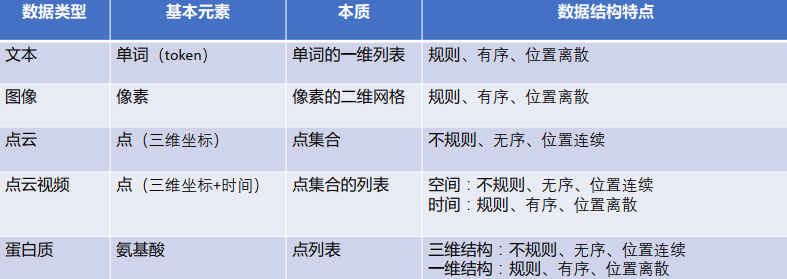

# 深度学习基础

>深度学习 = 人工神经网络 + 训练学习基础

## 数据

- 一维：文本、声音
- 二维：图像
- 三维：点云、蛋白质

- 

### 图像

- 每个网格用一个像素表示，规则有序

- $I \in R^{H\times W\times C}$

    - H：height，W：width

    - C：channel通道数，RGB=3

### 文本

- 构建词典
- 转化为数字序列(1,2,3)，再转化为vector([1,0,0],[0,1,0],[0,0,1])
- word embedding转化

### 点云

- 本质：点集合

## 人工神经网络

- 本质：参数化的函数 $y=f(x;\theta)$ 
>$y = ax + b$ ，$\theta=\{a,b\}$ 
>该神经网络只是个简单的线性函数，只有两个可学习参数𝜃={𝑎,𝑏}。实际中的网络非常复杂，并且具有大量学习参数。

### 分类

- 多层感知机 MLP
    - 
- 卷积神经网络 CNN
- 循环神经网络 RNN
- Transformer
- 图网络 GNN

## 训练学习策略

>四大任务：分类 - 语义分割 - 目标检测 - 生成

- 监督学习
    - 输入数据带有标签。监督学习建立一个学习过程，将预测结果与 “训练数据”（即输入数据）的实际结果进行比较，不断的调整预测模型，直到模型的预测结果达到一个预期的准确率。 
- 无监督学习
    - 输入数据没有标签，而是通过算法来推断数据的内在联系。 
- 半监督学习
    - 输入数据部分标签，是监督学习的延伸，常用于分类和回归。常用算法包括图论推理算法、拉普拉斯支持向量机等。
- 弱监督学习
    - 在许多任务中，由于数据标注过程的成本过高，很难获得像全部真值这样的强标注信息，即数据标签带有噪声。
- 强化学习
    - 输入数据作为对模型的反馈，强调如何基于环境而行动，以取得最大化的预期利益。与监督式学习之间的区别在于，它并不需要出现正确的输入 / 输出对，也不需要精确校正次优化的行为。强化学习更加专注于在线规划，需要在探索（在未知的领域）和遵从（现有知识）之间找到平衡。
